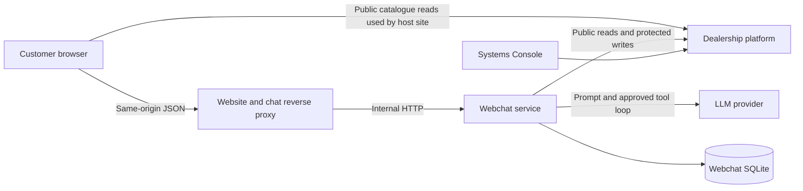
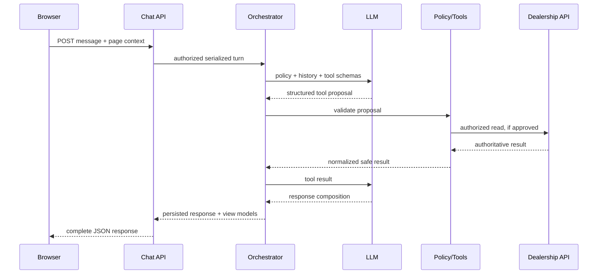
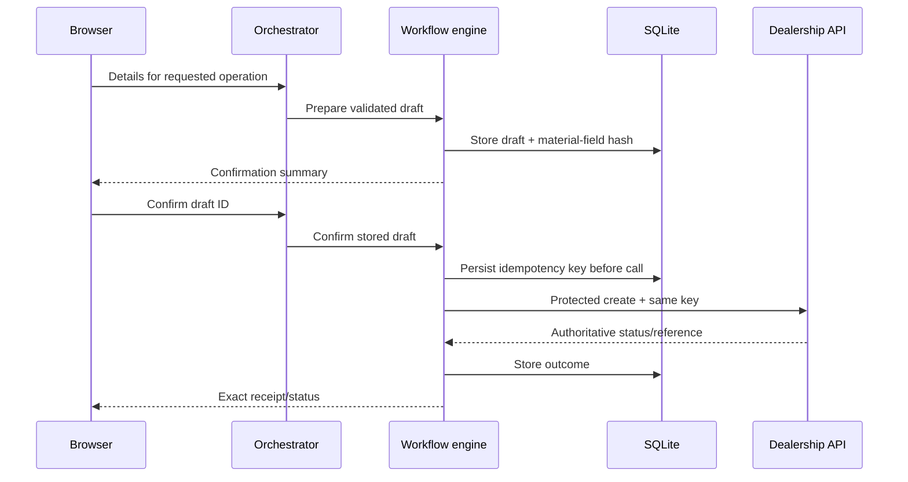

# Northstar Motors AI Webchat — High-Level Design

## 1. Design goals

The solution adds an embedded chat experience without changing the supplied dealership platform.
It keeps all secrets and protected operations server-side, uses the dealership API as the sole
business source of truth, and separates probabilistic language understanding from deterministic
authorization and workflow rules.

## 2. Proposed technology

| Area | Choice | Reason |
| --- | --- | --- |
| Chat UI | Native HTML, CSS, and ES modules | Fits the dependency-light host website and permits full accessible interaction control |
| Webchat backend | Python 3.12 with FastAPI | Typed request validation, async upstream HTTP, and straightforward testing |
| Persistence | SQLite | Local, durable, transactional, and requires no additional hosted service |
| LLM integration | OpenAI Responses API behind a provider interface | Tool calling and provider isolation; model is configurable |
| Dealership integration | Typed async HTTP adapter | Centralizes authentication, timeout, validation, retries, and error mapping |
| Runtime | Docker Compose | Matches the supplied clean-checkout workflow |
| Tests | Pytest plus browser tests | Covers application logic, API integration, and accessible user journeys |

These choices are implementation decisions for this assignment, not changes to the supplied
dealership service.

## 3. System context

Trust boundaries:

- The browser is untrusted and never receives the dealership or LLM API key.
- The webchat service owns conversation authorization, validation, tool policy, confirmations,
  idempotency, and persistence.
- The LLM proposes structured tool calls but cannot access the network or database directly.
- The dealership platform remains authoritative for business data and state transitions.

## 4. Container and network architecture

Docker Compose will contain three services:

1. `dealership-platform` on host port 4010, unchanged.
2. `dealership-website` on host port 4173, extended with webchat UI assets and a narrow
   `/api/chat` reverse proxy.
3. `webchat-service` on internal container port 4020, using an internal URL such as
   `http://dealership-platform:4010` for platform calls.

The website server proxies `/api/chat/...` to the internal webchat service, so the browser uses the
existing `http://localhost:4173` origin. This permits a same-origin `HttpOnly` conversation cookie,
avoids cross-origin token storage, and removes browser CORS configuration. In production, the same
route is served over HTTPS.

The chat service uses a named volume for its SQLite database. The existing platform volume and
reset behaviour stay unchanged. The webchat can expose its own explicit reset command for local
development, but the supplied `reset.sh` must continue to mean “restore dealership seed data”.

## 5. Major components

### 5.1 Embedded webchat UI

Responsibilities:

- launcher, panel/dialog, transcript, composer, unread count, and status announcements;
- render text plus typed cards for vehicles, offers, slots, choices, confirmation summaries, and
  operation receipts;
- gather page context from allow-listed DOM/URL values;
- retain only the opaque conversation ID and non-sensitive UI preferences in browser storage;
- send messages, show an immediate generic progress state, retry safely, and restore history;
- manage focus, keyboard use, screen-reader announcements, and responsive layout.

The UI does not render arbitrary model HTML. Rich output uses a closed set of JSON view models and
safe DOM creation. Plain assistant text is rendered as text with an allow-listed link format.

### 5.2 Public chat API

Responsibilities:

- create and authorize anonymous conversations;
- accept user messages and page context;
- serialize concurrent turns per conversation;
- expose history and safe deduplicated retry endpoints;
- enforce size limits and origin/rate controls;
- return one complete, structured JSON result for each synchronous turn request.

### 5.3 Conversation orchestrator

Responsibilities:

- load recent messages, active workflow, selected entities, and compact summary;
- construct the system policy and tool catalogue;
- run a bounded model/tool loop;
- pass tool proposals to the policy engine;
- persist tool results and the final response atomically where possible;
- convert deterministic business outcomes into safe response facts/view models.

Only a bounded number of model/tool iterations and tool calls are allowed per turn. Model failure
does not erase a pending workflow or create an unconfirmed write.

### 5.4 Workflow and policy engine

This is the safety-critical boundary. It owns:

- supported intent/tool allow-list;
- per-operation required fields and server-side validation;
- draft state and missing-field detection;
- explicit confirmation state and confirmation invalidation;
- availability rechecks before dependent actions;
- verified-booking scope for amendment/cancellation;
- idempotency key creation and reuse for record creation, plus local action deduplication for
  amendments and cancellations;
- mapping of platform statuses and errors to permitted customer claims.

The LLM cannot directly call a mutation tool. It can prepare a draft and request confirmation. A
separate confirmation action checks the stored draft hash and invokes the platform adapter.

### 5.5 Dealership platform adapter

Responsibilities:

- provide one typed method for each supported platform operation;
- attach `X-API-Key` only to protected calls;
- attach the persisted `Idempotency-Key` to record-creation endpoints that support it;
- enforce connect/read timeouts and response-size limits;
- normalize money, timestamps, relative asset URLs, and structured errors;
- retry safe reads and eligible timed-out record creation using the same idempotency key;
- never log request bodies containing personal data.

### 5.6 LLM provider adapter

Responsibilities:

- expose a provider-neutral `generate_turn` interface;
- translate internal tool definitions to the provider format;
- enforce model name, timeout, maximum output, and bounded retries;
- record usage/latency without storing secrets or raw personal data in operational logs;
- provide a deterministic fake for tests.

The model receives only the minimum conversation window and tool results needed for the turn.
Sensitive lookup proof values are not included again after the deterministic lookup completes.

### 5.7 Persistence

SQLite stores:

- conversations and opaque authorization-token hashes;
- messages and typed view payloads, with sensitive workflow submissions represented by redacted
  placeholders rather than their raw values;
- workflow drafts and confirmation hashes;
- model/tool turn records and sanitized errors;
- business-operation attempts, idempotency keys, and returned public references;
- temporary verified-booking grants scoped to a conversation.

Database access is behind repositories. Migrations run during startup in a transaction. Sensitive
fields use a retention category so cleanup can remove them earlier than ordinary transcript data.

### 5.8 Observability

Structured JSON logs include timestamp, correlation ID, conversation ID hash, turn ID, component,
operation name, duration, result category, retry count, and upstream status/code. They exclude
message bodies and customer contact/lookup values.

Metrics suitable for a later production deployment include turn latency, tool error rate,
conversation recovery, mutation success by operation type, LLM timeout, and upstream timeout.

## 6. Request lifecycle

### 6.1 Normal conversational turn

### 6.2 Confirmed record creation

If the response is lost, retrying the same confirmed record creation loads the stored idempotency
key. Amendments and cancellations use a persisted client action ID for local deduplication; after an
ambiguous upstream outcome, the service reads the booking state to reconcile rather than assuming
the mutation failed. If the customer changes a material field, the stored hash changes and a new
confirmation is required.

### 6.3 Verified workshop management

The assistant opens a structured sensitive-input card for the four lookup values. The card submits
them to a deterministic lookup endpoint rather than through the chat transcript or LLM. The values
go directly from validated request state to the dealership lookup adapter and are not persisted or
logged. On success, the service stores a short-lived grant containing the conversation ID, internal
booking ID, returned reference, and expiry. Amend/cancel tools require that grant and do not accept
an arbitrary internal record ID from the model or browser.

## 7. Conversation and tool design

Tools are divided into three classes:

- Reads: vehicle search/details/availability, offers, dealerships/hours, services, locations,
  slots, business notices.
- Draft builders: enquiry, test drive, interest, callback, workshop booking, workshop management,
  message, and valuation.
- Controlled actions: confirm a stored draft, verify a workshop lookup, amend a verified booking,
  and cancel a verified booking.

Tool outputs are concise structured facts, not raw unbounded upstream responses. The orchestration
prompt defines business semantics, but the application also encodes them so correctness does not
depend on the model remembering prose.

## 8. Data ownership and state

| Data | System of record | Webchat copy |
| --- | --- | --- |
| Vehicles, offers, locations, hours, slots | Dealership platform | Turn/tool snapshot only |
| Business records and statuses | Dealership platform | Operation ID/reference/status snapshot |
| Conversation messages | Webchat SQLite | Retained conversation with sensitive-form submissions redacted |
| Pending workflow | Webchat SQLite | Structured draft and confirmation state |
| API/LLM secrets | Environment | Never persisted or sent to browser |
| Browser session | Webchat backend | Script stores opaque ID; authorization token is an `HttpOnly` cookie |

No availability or slot cache is trusted for a write. The relevant state is checked again at the
operation boundary.

## 9. Security design

### Threats and controls

| Threat | Primary controls |
| --- | --- |
| API-key exposure | Keys only in webchat environment; no protected browser calls; redacted errors |
| Prompt injection | Allow-listed tools and parameters; page context treated as data; no model network access |
| Unconfirmed/incorrect write | Stored draft, material hash, explicit confirmation, deterministic policy check |
| Duplicate record | Persist key before create; same key/body on retry; per-draft operation state |
| Booking enumeration | Four-field platform lookup; generic failure; rate limits; no field-specific hints |
| Cross-conversation access | Same-origin `HttpOnly` cookie with random token, hashed at rest and verified in constant time |
| XSS from model output | Text rendering and closed typed components; URL scheme/host allow-list |
| Sensitive logs | Field-level redaction; no bodies; correlation metadata only |
| Abuse/large inputs | Origin controls, rate limits, schema and length limits, bounded model/tool loops |
| Race conditions | Per-conversation lock; SQLite transactions; platform atomic slot claims |

Local development uses HTTP with the cookie `Secure` flag disabled by configuration. Production
requires HTTPS, `Secure` cookies, secure headers, and a restrictive content security policy.

## 10. Resilience and failure handling

- Browser disconnect: turn continues only through the safe stage; a committed write outcome is
  persisted and visible after reconnect.
- LLM timeout: no mutation happens unless the deterministic confirmed-action path was reached;
  workflow state stays recoverable.
- Dealership read timeout: bounded retry with jitter, then a retryable user message.
- Dealership record-creation timeout: retry only with the already-persisted key and identical body.
- Amendment/cancellation timeout: reconcile the booking through an authorized read; do not issue a
  blind retry when the upstream outcome is unknown.
- Platform structured error: preserve code and map it to the documented recovery behaviour.
- Database failure: readiness becomes unhealthy; no unpersisted business write is intentionally
  started.
- No result/availability: treat as a valid outcome and offer refinements or alternatives.

## 11. Deployment configuration

Required variables:

- `OPENAI_API_KEY`
- `NORTHSTAR_API_KEY`

Documented non-secret variables with defaults:

- `OPENAI_MODEL`
- `NORTHSTAR_BASE_URL=http://dealership-platform:4010`
- `WEBCHAT_PORT=4020`
- `WEBCHAT_DATABASE_PATH=/data/webchat.sqlite3`
- `WEBCHAT_COOKIE_SECURE=false`
- `WEBCHAT_RETENTION_DAYS=30`
- `LOG_LEVEL=INFO`

Compose passes the secret values from a local `.env`; `.env.example` contains names and safe
defaults only.

## 12. Verification strategy

- Unit tests: workflow transitions, field validation, confirmation invalidation, status/error
  mapping, money/date formatting, prompt/tool policy, and redaction.
- Contract tests: every adapter operation against representative OpenAPI responses.
- Integration tests: real seeded dealership container plus fake LLM; verify platform records and
  idempotent record-creation retries.
- LLM behaviour tests: fixed scenarios evaluated for correct tool choice and prohibited claims,
  separated from deterministic CI tests.
- Browser tests: persistence, page context, cards/links, focus, keyboard, mobile layout, loading,
  unread, error recovery, and confirmation.
- Static checks: secret scanning, lint/format, dependency audit where available, and accessible-name
  assertions.

## 13. Delivery sequence

1. Foundation: service skeleton, migrations, chat session API, fake provider, health checks.
2. Read journeys: vehicle, offer, dealership, service, location, hours, and slot tools.
3. UI: accessible shell, history, typed cards, page context, and reconnect behaviour.
4. Writes: workflow drafts, confirmation engine, dealership writes, and idempotency.
5. Booking management: lookup proof handling and verified-grant enforcement.
6. Hardening: error policy, retries, timeouts, retention, rate limiting, redaction, and CSP.
7. Evidence: automated seeded scenarios, README, environment example, decisions, and limitations.

## 14. Architectural decisions and trade-offs

- **Separate webchat service:** adds one local container but prevents secret leakage and gives a
  clear security/persistence boundary.
- **SQLite:** ideal for a self-contained assignment; horizontal multi-instance deployment would
  require a shared database and distributed conversation locking.
- **Server-owned workflow state:** slightly more code than direct model-to-API calls, but makes
  confirmation, identity scope, and retries testable and deterministic.
- **Typed rich components:** less expressive than arbitrary model HTML, but materially safer and
  more accessible.
- **Provider abstraction:** preserves testability and avoids coupling application policy to one
  SDK, while the initial production adapter remains deliberately small.
