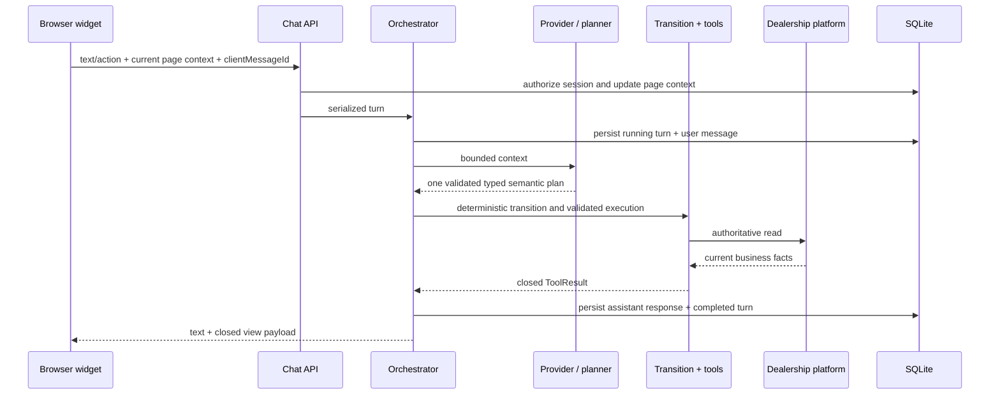

# Northstar Motors AI Webchat — High-Level Design

## 1. Document status and scope

This document describes the **current implementation** of `webchat-service`, not a proposed future
architecture. The service adds an AI-assisted webchat to the dealership website while treating the
supplied dealership platform as the authoritative business system.

The design has three non-negotiable boundaries:

- dealership and AI credentials stay on the server;
- language understanding may be probabilistic, but tool selection, validation, state transitions,
  confirmation, persistence, and business effects are application-owned;
- `dealership-platform` remains an external dependency and is not modified by the webchat.

## 2. Goals and quality attributes

| Goal | Current design response |
| --- | --- |
| Safe AI assistance | The model emits one typed semantic plan; application code maps it to exact tools |
| Authoritative answers | Dynamic vehicle, offer, hours, service, slot, and status facts come from the dealership API |
| Confirmed writes | Write requests are persisted as drafts and require an explicit confirmation endpoint |
| Conversation continuity | Messages, page snapshots, workflow state, attempts, and receipts are stored in SQLite |
| Browser safety | The widget uses closed view types and DOM text APIs rather than model-provided HTML |
| Privacy | HttpOnly conversation authorization, structured redaction, and a separate booking-proof endpoint |
| Testability | Provider, platform, repositories, transition routing, and tool handlers have focused interfaces |
| Local operability | Docker Compose, a fake local provider, health endpoints, and isolated Pytest execution |

## 3. Current system architecture

Editable source: [`diagrams/webchat-system-architecture.mmd`](./diagrams/webchat-system-architecture.mmd).

### 3.1 Runtime containers

| Container | Host port | Responsibility |
| --- | ---: | --- |
| `dealership-website` | 4173 | Hosts the customer website and loads `webchat-service/widget/embed.js` |
| `webchat-service` | 4020 | Serves the widget, chat API, orchestration, workflows, and webchat SQLite data |
| `dealership-platform` | 4010 | Authoritative catalogue and protected business operations |

The website may continue making its own public catalogue reads. The widget sends credentialed chat
requests only to `webchat-service`. The webchat calls the dealership platform over the Compose
network and attaches `X-API-Key` only to protected platform operations.

### 3.2 Trust boundaries

- **Browser:** untrusted input and display surface. It never receives the dealership key, OpenAI
  key, Azure key, server-side booking ID, or idempotency key.
- **Webchat service:** trusted policy boundary. It authorizes conversations, validates schemas,
  serializes turns, controls tools, persists workflow state, and performs confirmed effects.
- **AI provider:** semantic planner only. It cannot access SQLite, call the dealership platform,
  choose HTTP paths, or confirm a mutation.
- **Dealership platform:** authoritative source for business facts and operation outcomes.

## 4. Technology and deployment choices

| Area | Current choice | Reason |
| --- | --- | --- |
| Widget | Native web component, HTML, CSS, and ES modules | Dependency-light integration and explicit DOM safety |
| Backend | Python 3.12 and FastAPI | Typed validation, async HTTP, and straightforward testing |
| Persistence | SQLite with migrations and WAL mode | Durable local state without another service |
| AI | OpenAI Responses API or Azure OpenAI behind `LlmProvider` | Typed planning and provider isolation |
| Local fallback | `FakeLlmProvider` backed by `DeterministicTurnPlanner` | Same validated plan boundary for deterministic offline development and CI |
| Platform integration | `httpx.AsyncClient` in `DealershipClient` | One boundary for credentials, timeouts, assets, and errors |
| Runtime | Docker Compose | Reproducible three-service local environment |
| Verification | Pytest, Ruff, Node syntax checks, and manual browser journeys | Covers current automated and manual test surfaces |

## 5. Major application components

### 5.1 Browser widget

The service-hosted `<northstar-chat>` web component owns:

- launcher, dialog, conversation history, transcript, composer, progress, focus, and unread state;
- page-context capture from bounded page text, visible controls, structured entities, URL, heading,
  description, and open host dialogs;
- safe rendering of vehicles, offers, dealerships, opening hours, services, slots, suggestions,
  forms, confirmations, booking details, and receipts;
- synchronous JSON calls to the chat API with credentials included;
- safe retry identifiers (`clientMessageId` and `clientActionId`);
- an ordinary-form profile in `localStorage` for reusable form values.

Browser storage currently contains the opaque conversation ID, open/closed preference, and ordinary
form-profile values. Private workshop lookup forms are excluded from profile capture and prefill.
Conversation authorization remains in the `HttpOnly`, `SameSite=Lax` cookie.

### 5.2 HTTP and security boundary

FastAPI routes under `/api/chat/v1` provide conversation, turn, read-option, draft, confirmation,
private lookup, and verified workshop-management endpoints. `SecurityMiddleware` applies:

- a 64 KiB declared request-body limit;
- JSON content-type enforcement for POST/PATCH;
- exact configured-origin validation for state changes;
- an in-memory per-client limit of 60 chat API requests per minute;
- `nosniff`, same-origin referrer policy, and a restrictive response CSP.

Conversation creation sets an opaque session cookie. The database stores a SHA-256 hash, and later
routes return `404` rather than disclosing whether an unauthorized conversation exists.

### 5.3 Conversation orchestration

`Orchestrator` owns only turn lifecycle:

1. acquire an in-process per-conversation lock;
2. deduplicate `clientMessageId`;
3. persist the running turn and user message;
4. build bounded context;
5. run a typed action directly or send natural language to the semantic provider;
6. execute validated tools through the registry;
7. present and persist the final assistant message;
8. mark the turn completed or failed with a sanitized error category.

Context, planning, tools, provider loops, presentation, and workflows live in separate packages so
the coordinator does not own their internal branching.

### 5.4 AI planning and deterministic routing

Editable source: [`diagrams/ai-turn-orchestration.mmd`](./diagrams/ai-turn-orchestration.mmd).

With OpenAI or Azure configured, the provider exposes only `plan_customer_turn`. The model must
return exactly one V2 `TurnPlanPayload`: a valid domain-goal pair, that domain's bounded arguments,
and an optional response. The schema is a discriminated union, so arguments from another domain,
unknown fields, and invalid domain-goal combinations are rejected before execution.
`TransitionController` resolves trusted references and workflow context, then
checks that the typed goal conforms to the current utterance. `ToolTransitionRouter` then maps the
canonical `GoalKey` to one exact application tool. In particular, `vehicle.search` requires real
discovery evidence: a substantive stock constraint, explicit inventory-discovery wording, or a
grounded reference to displayed results. A vehicle noun plus a provider-default sort cannot execute
the stock API. Conversely, a broad-preference plan carrying an executable stock constraint is
normalized to vehicle search so valid filters are not discarded behind a chooser.

`SemanticPlanPolicy` evaluates every validated provider plan. Business goals pass directly to
transition control; only `conversation.respond` can trigger recovery. In enforcement mode, a
confident deterministic application route replaces unsafe prose. A business-looking request
without a certain local route gets one constrained re-plan; repeated prose becomes a fixed
server-owned clarification. Genuine conversation remains eligible for prose. Observe mode logs the
proposed decision without changing the response; off mode bypasses intervention.

Replacement routes do not execute their tool-shaped result directly. `DeterministicPlanRouter`
adapts each one into the same schema-validated V2 plan used by the configured provider, so goal
conformance, state transitions, exact tool mapping, and input filtering cannot be bypassed by the
online safety path.

Without an OpenAI key in development/test, `FakeLlmProvider` delegates to
`DeterministicTurnPlanner`. It converts deterministic goal rules and confident local routes into
the same schema-validated V2 `TurnPlan` returned by OpenAI/Azure. From that point onward, fake and
hosted requests use the same semantic plan policy, `TransitionController`, `ToolTransitionRouter`,
`ToolRegistry`, workflow-state handling, and presenter. Deterministic application routing is
consulted only after a provider proposes `conversation.respond`; it never preempts semantic planning.

The application owns the ontology in `planning/ontology.py`. New workflow state persists
`{version: 2, domain, goal, stage, entities, constraints}`. A confined compatibility adapter upgrades
already-stored V1 `intent` states; legacy names are not accepted from new model output.

The provider loop allows at most four iterations—including at most one gate-triggered re-plan—and
rejects provider responses containing more than four tool calls. A renderable `ToolResult`
terminates immediately; non-renderable trusted facts may be appended to bounded history for the
next provider step. The deterministic fact responder remains active when trusted workflow-state
context follows the tool result in history.

### 5.5 Tool execution

`ToolRegistry` is a dispatcher over focused capability handlers:

| Handler | Capability |
| --- | --- |
| `VehicleToolHandler` | Search, page-scoped selection, facets, details, availability, comparison |
| `CatalogueToolHandler` | Offers, dealerships, departments, opening hours, business information |
| `BusinessInformationResolver` | Match exact questions to described live platform facts and reject unsupported answers |
| `WorkshopReadToolHandler` | Service information, services, locations, test-drive and workshop slots |
| `FormToolHandler` | Private lookup form, part-exchange estimate form, indicative estimate |
| `WorkflowToolHandler` | Prepare supported write-workflow drafts and confirmation views |

Inputs use strict Pydantic models with unknown fields rejected. Every handler returns the shared
`ToolResult` contract: customer-facing text, an optional closed view type/payload, and trusted facts.

Customer-entered town names are matched against the live dealership list. Exact normalized matches
win; otherwise a conservative similarity threshold and uniqueness margin allow clear misspellings
such as `Manchaester` while leaving unrelated or ambiguous locations unresolved.

Named workshop-service questions are resolved against the current live service catalogue. The
result is typed as `matched`, `ambiguous`, or `unsupported`. An unsupported service such as car
cleaning receives a concise unavailable response plus a link to browse supported services; it does
not render the entire catalogue as though the question were a browse request.

Business-information plans carry the untouched customer question from transition context into a
fact resolver. The resolver searches descriptions and current values for the requested topic; the
topic alone is never evidence that a fact answers the question. A match renders only the selected
fact, while ambiguous or unavailable outcomes terminate with application-owned text. Existing
version-1 bulk cards remain renderable when old conversations are restored, but new turns never
expose unrelated finance, privacy, and part-exchange notices together.

If an operational question is misclassified as `vehicle.search` without discovery evidence,
transition conformance redirects it to scoped business-information answerability before any stock
tool runs. Relevant active context selects the topic, but never supplies an answer. When the live
facts do not describe that policy, the resolver fails closed and offers dealership contact.

### 5.6 Workflow safety boundary

Editable source: [`diagrams/write-workflow-lifecycle.mmd`](./diagrams/write-workflow-lifecycle.mmd).

The workflow service supports sales enquiries, test drives, reserved-vehicle interest, callbacks,
workshop bookings, workshop amendments/cancellations, dealership messages, and part exchange.

Preparation validates required fields, stores a new draft and SHA-256 material hash, and returns
either a collecting form or confirmation summary. Confirmation accepts only the stored draft ID and
a `clientActionId`. An atomic transaction moves the draft to `executing` and persists the operation
attempt and idempotency key before the protected call.

Creation operations use the persisted idempotency key. Vehicle interest rechecks that the vehicle
is currently reserved. Workshop amend/cancel requires a valid conversation-scoped verified grant.
Successful public receipts replace stale draft cards and are reconciled during history restoration.

### 5.7 Dealership integration

`DealershipClient` owns all platform HTTP traffic. It:

- uses 3-second connect and 8-second overall timeouts;
- attaches `X-API-Key` only for protected operations;
- attaches `Idempotency-Key` to supported record creation;
- normalizes platform-relative asset URLs;
- proxies vehicle images only from the expected platform host and asset path;
- normalizes structured upstream errors into `DealershipError`;
- rejects declared JSON responses over 2 MB and vehicle images over 5 MB.

The current adapter does **not** automatically retry platform calls.

### 5.8 Persistence and restoration

SQLite stores conversations, session hashes, initial/current page context, workflow state, turns,
messages, workflow drafts, operation attempts, public receipts, and verified booking grants.
Repositories isolate SQL from API/orchestration code. Startup runs ordered migrations and expires
old active conversations.

Conversation restoration removes obsolete pending cards, replaces completed drafts with receipts,
and reconstructs a missing receipt from succeeded workflow state when necessary.

### 5.9 Observability

Logs use a JSON formatter and structured redaction. Sensitive keys, embedded email addresses,
telephone numbers, and bearer tokens are removed. Turn failures log the exception type rather than
returning private exception details to the browser.

## 6. Main request flows

### 6.1 Conversational read

### 6.2 Private workshop lookup

The widget renders an application-owned four-field form. It posts directly to the deterministic
lookup endpoint rather than the ordinary turn endpoint. The proof values are validated in memory,
sent to the protected dealership lookup, and excluded from messages, model input, workflow drafts,
logs, and the saved form profile. Success stores only a safe booking snapshot and server-side record
ID in a 30-minute verified grant.

## 7. Data ownership

| Data | Source of truth | Webchat responsibility |
| --- | --- | --- |
| Vehicles, offers, locations, hours, services, slots | Dealership platform | Fetch and normalize for a turn/view |
| Business record status/reference | Dealership platform | Persist public receipt snapshot |
| Conversations and messages | Webchat SQLite | Durable transcript and typed views |
| Current workflow stage | Webchat SQLite | Deterministic transition state |
| Draft fields and attempts | Webchat SQLite | Validate, confirm, deduplicate, execute |
| Booking proof | Request memory only | Forward to lookup; never persist |
| Verified booking authorization | Webchat SQLite | 30-minute conversation-scoped grant |
| AI/dealership credentials | Environment | Server use only |
| Conversation authorization | HttpOnly cookie + SQLite hash | Browser cannot read token |
| Ordinary form profile | Browser localStorage | Prefill ordinary forms; exclude private lookup |

## 8. Security controls

| Threat | Current control |
| --- | --- |
| Credential exposure | Secrets remain in environment/server adapters |
| Prompt injection | Page snapshots are labelled data; model exposes only a typed semantic planner |
| Arbitrary tool execution | Domain-goal schema, deterministic transition router, registry allow-list, strict inputs |
| Unconfirmed write | Stored draft plus explicit confirmation endpoint |
| Duplicate create | Unique client action plus persisted idempotency key |
| Cross-conversation access | Random cookie, SHA-256 session hash, conversation-scoped authorization |
| Booking enumeration | Four-field deterministic lookup and generic not-found behavior |
| Booking ID tampering | Server-side verified grant supplies internal record ID |
| Model HTML/XSS | `textContent`, closed renderers, controlled vehicle links/images |
| Sensitive logging | Structured key and pattern redaction |
| Oversized/abusive requests | Schema limits, declared body limit, in-memory rate limit, bounded provider loop |

## 9. Current resilience behavior

- Duplicate turn IDs return the stored turn result.
- Duplicate confirmation action IDs return the persisted attempt outcome.
- A retryable platform failure returns a draft to `awaiting_confirmation`; final failures mark it
  failed.
- Provider timeout marks the turn `failed` with `LLM_TIMEOUT`.
- Other orchestration failures are sanitized as `LLM_INVALID_RESPONSE`.
- Service startup fails when required Azure settings are incomplete or production OpenAI settings
  are missing.
- Readiness currently reports database migration readiness only.

## 10. Known limitations

- Conversation locks and request-rate counters are in-process and therefore single-instance.
- The dealership adapter has timeouts and normalized errors but no automatic retry/backoff.
- Ambiguous workshop PATCH/DELETE outcomes are not automatically reconciled with a follow-up read.
- Browser behavior is manually regression-tested; there is no installed automated browser runner.
- The 64 KiB request limit relies on `Content-Length`; request bodies are not streamed through a
  separate hard-cap reader.
- SQLite is appropriate for this deployment but not a horizontally scaled multi-instance service.
- Draft contact data is stored server-side for workflow execution; it is hidden from confirmation
  summaries but does not yet have a separate early-cleanup job.
- Conversation-response enforcement deliberately uses conservative application signals. Novel wording
  that matches neither a deterministic route nor a strong business signal remains visible in
  observe logs for future rule refinement.

## 11. Verification status

The current isolated webchat image passes:

- 335 Pytest tests covering unit, integration, security, contract, workflow, provider, transition,
  restoration, and API behavior;
- Ruff checks for `webchat` and `tests`;
- Node syntax checks for all widget ES modules;
- 8 Node module tests covering scoped/restored business cards, confirmations, saved form profiles,
  private lookup exclusion, and retry/recovery behavior;
- package verification for nested `widget/core` and `widget/views` assets.

Automated tests use mock transports and temporary SQLite databases; they do not require mutation of
the supplied dealership source tree.

## 12. Architectural decisions and trade-offs

- **Separate webchat service:** creates another container but keeps browser and platform secrets
  separated.
- **Versioned domain-goal plan instead of model-selected business tools:** adds deterministic mapping code but
  makes business routing inspectable and testable.
- **Server-owned workflow drafts:** adds persistence and forms but makes confirmation and retries
  explicit.
- **Closed typed views:** trades arbitrary formatting for safer, predictable, accessible rendering.
- **Repository and capability packages:** adds files but reduces multi-purpose classes and makes
  dependencies directional.
- **Deterministic local planner:** provides offline behavior through the same plan and execution
  boundary, although rule-based language understanding remains less flexible than a hosted model.

## 13. Documentation map

- [`LLD.md`](./LLD.md): exact modules, endpoints, schemas, state machines, and tests.
- [`diagrams/README.md`](./diagrams/README.md): architecture images and editable sources.
- [`../webchat-service/README.md`](../webchat-service/README.md): service operation and module guide.
- Folder-level `README.md` files under `webchat-service/`: ownership and file catalogues.

Update this HLD whenever a trust boundary, external dependency, runtime container, persistence
technology, provider contract, or write-safety rule changes.
