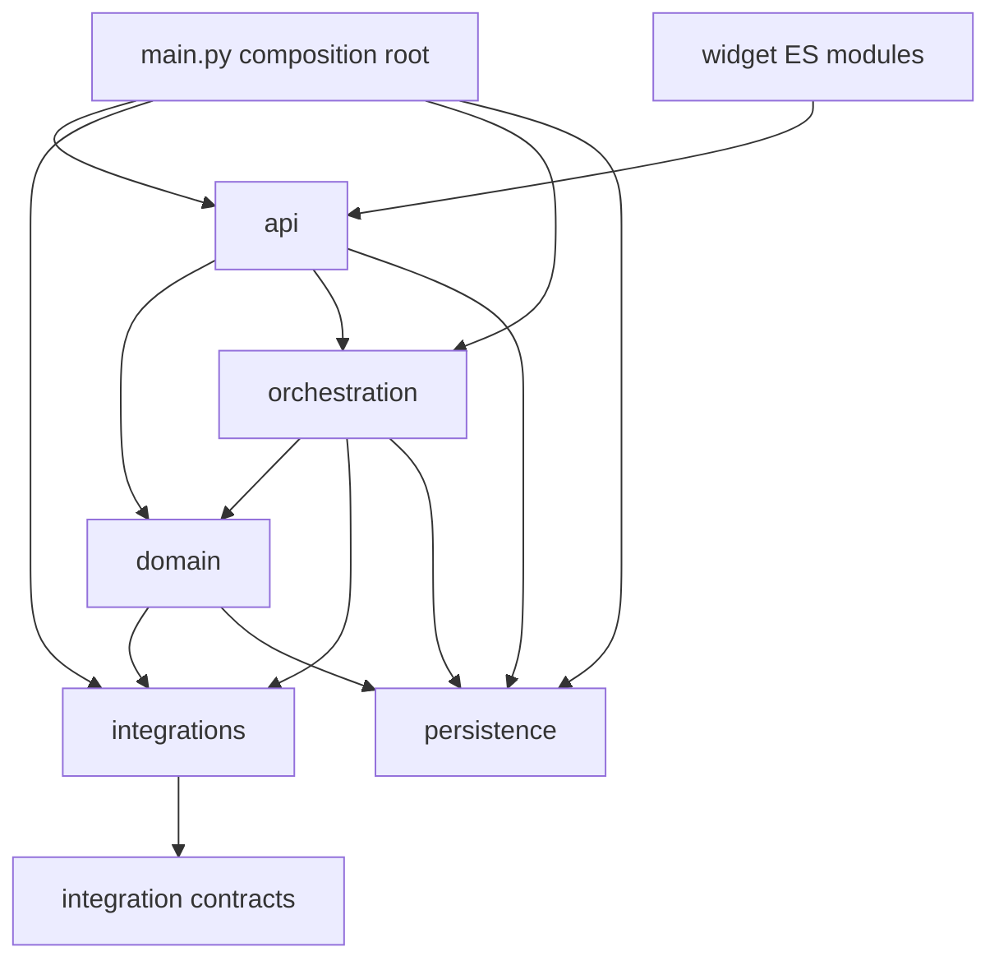
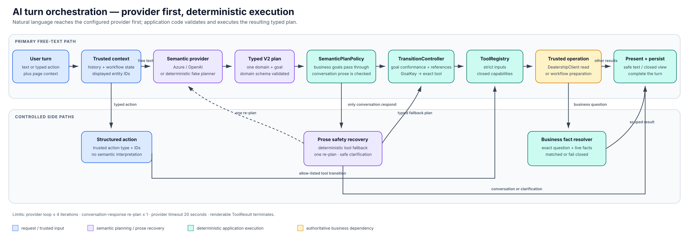
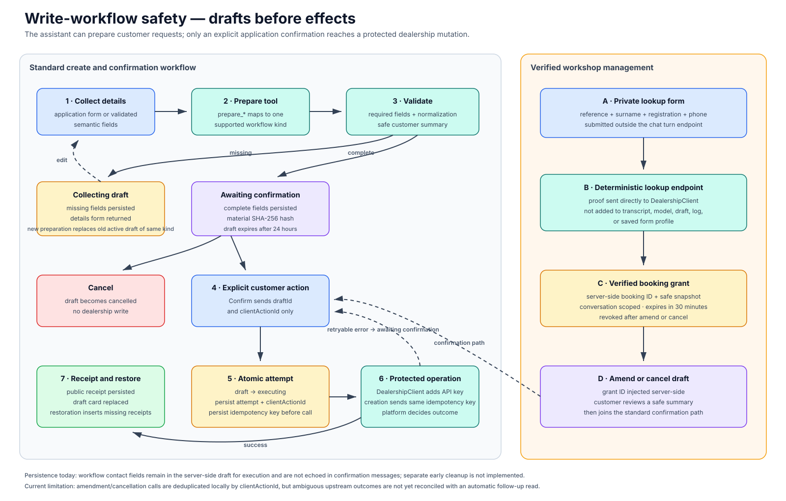

# Northstar Motors AI Webchat — Low-Level Design

## 1. Purpose and status

This document is the code-level specification for the **current** `webchat-service`. It describes
module ownership, runtime wiring, browser behavior, API contracts, orchestration, tool dispatch,
workflow state, SQLite tables, validation, and verification.

For system boundaries and architectural decisions, read [`HLD.md`](./HLD.md). Folder-level file
catalogues live in the `README.md` files under [`../webchat-service`](../webchat-service/README.md).

## 2. Current service structure

```text
webchat-service/
├── Dockerfile
├── pyproject.toml
├── README.md
├── webchat/
│   ├── main.py
│   ├── config.py
│   ├── api/
│   │   ├── conversations.py
│   │   ├── errors.py
│   │   ├── models.py
│   │   ├── restoration.py
│   │   └── security.py
│   ├── domain/
│   │   ├── business_semantics.py
│   │   ├── models.py
│   │   └── workflows.py
│   ├── integrations/
│   │   ├── contracts.py
│   │   ├── dealership.py
│   │   ├── openai_provider.py
│   │   └── fake_llm/{planner,provider}.py
│   ├── observability/
│   │   ├── logging.py
│   │   └── redaction.py
│   ├── orchestration/
│   │   ├── orchestrator.py
│   │   ├── context/builder.py
│   │   ├── planning/{ontology,plan_policy,prompt,tool_routes,transitions,turn_plan}.py
│   │   ├── presentation/{response,suggestions}.py
│   │   ├── routing/{context,parsers,responses,router}.py
│   │   ├── routing/routes/{base,support,vehicle,workshop}.py
│   │   ├── tools/
│   │   │   ├── actions.py
│   │   │   ├── business_information.py
│   │   │   ├── catalog.py
│   │   │   ├── contracts.py
│   │   │   ├── forms.py
│   │   │   ├── helpers.py
│   │   │   ├── inputs.py
│   │   │   ├── registry.py
│   │   │   ├── result.py
│   │   │   ├── service_resolution.py
│   │   │   ├── vehicles.py
│   │   │   ├── workflows.py
│   │   │   └── workshop.py
│   │   └── turns/provider_loop.py
│   ├── persistence/
│   │   ├── database.py
│   │   ├── repositories.py
│   │   └── migrations/*.sql
│   └── widget/
│       ├── embed.js
│       ├── northstar-chat-widget.js
│       ├── webchat.js
│       ├── webchat.css
│       ├── core/{api,context,dom,form-profile,format}.js
│       └── views/{message,message-content,suggestions,vehicle}.js
└── tests/
    ├── test_health.py
    ├── contract/
    ├── integration/
    └── unit/
```

There is no parallel legacy tool package and no flat-module compatibility layer. The
`orchestration` subpackages are the canonical import paths.

## 3. Runtime assembly

`webchat.main.create_app()` is the composition root.

During lifespan startup it:

1. configures structured logging;
2. opens/migrates SQLite and expires old conversations;
3. constructs conversation, message, turn, and workflow repositories;
4. constructs `DealershipClient`;
5. constructs `ConversationRestorer`, `WorkflowService`, and `ToolRegistry`;
6. selects Azure OpenAI, OpenAI, or `FakeLlmProvider`;
7. configures post-provider `SemanticPlanPolicy` with deterministic fallback routing;
8. constructs `Orchestrator` and marks database readiness.

Shutdown closes owned dealership and provider HTTP clients.

### 3.1 Provider selection

```text
LLM_PROVIDER=azure
    └── Azure settings must all be present → OpenAIProvider(azure=True)

LLM_PROVIDER=openai + OPENAI_API_KEY present
    └── OpenAIProvider

LLM_PROVIDER=openai + no key + non-production
    └── FakeLlmProvider(DeterministicTurnPlanner)

production + no OpenAI key
    └── configuration error during app creation
```

## 4. Package dependency direction



The composition root supplies concrete dependencies. Focused `Protocol` interfaces in context,
tools, fake planning, and restoration keep consumers dependent on the behavior they require.

## 5. Browser widget

### 5.1 Module ownership

| Module | Responsibility |
| --- | --- |
| `embed.js` | Mount one widget and expose the small `window.NorthstarChat` host API |
| `northstar-chat-widget.js` | Define the web component, Shadow DOM shell, and host layout behavior |
| `webchat.js` | UI state, conversation lifecycle, events, API coordination, and inline workflows |
| `core/api.js` | Credentialed fetch client and safe API error normalization |
| `core/context.js` | Bounded page/context extraction and host-supplied context validation |
| `core/dom.js` | Safe text-element construction |
| `core/form-profile.js` | Save/prefill ordinary form fields; exclude private booking lookup |
| `core/format.js` | GBP formatting from integer pence |
| `views/message.js` | Closed renderer registry, forms, confirmations, slots, receipts, business cards |
| `views/message-content.js` | Safe paragraph/list-like assistant text presentation |
| `views/suggestions.js` | Typed suggestion/action buttons |
| `views/vehicle.js` | Vehicle cards, availability, and comparison table |
| `webchat.css` | Shadow DOM layout, responsive states, cards, forms, and accessibility styling |

### 5.2 Browser state

Controller state is closure-owned rather than a global store:

```js
{
  conversationId,
  initialized,
  pendingClientId,
  unreadCount,
  progressTimer,
  panel.open
}
```

`localStorage` keys:

| Key | Value |
| --- | --- |
| `northstarConversationId` | Opaque current conversation UUID |
| `northstarChatOpen` | String preference used to reopen the panel |
| `northstarFormProfileV1` | Ordinary reusable form values, capped to 2,000 characters each |

The form profile excludes hidden/password/file/button fields, disabled/read-only fields, internal
IDs, and every field inside `[data-private-lookup]`. Server-originated form values marked with
`data-profile-value-source="server"` are not overwritten.

### 5.3 Page-context payload

`core/context.js` returns:

```js
{
  path, section, vehicleId, title,
  heading, description, pageText, dialogText,
  controls: [{ name, label, value }],
  entities: [{ type, id, label, attributes }]
}
```

Sources include the current URL, visible section, bounded `innerText`, visible controls, elements
with `data-chat-entity`, an open host dialog, and optional host calls to
`NorthstarChat.setContext()`. Identifiers and lengths are allow-listed. The backend labels these
snapshots as data, not instructions; dynamic facts still require dealership tools.

Limits match `api.models.PageContext`: 6,000 characters of page text, 3,000 dialog characters,
30 controls, 50 entities, and 24 scalar attributes per entity.

### 5.4 Rendering contract

The widget never assigns model content to `innerHTML`. The component template and CSS are static;
runtime content is created with DOM APIs and `textContent`. Rich output is selected by a registry
of application-owned view types, including:

- vehicle list, availability, and comparison;
- offer, dealership, opening-hours, service, and workshop-location cards;
- test-drive/workshop slot pickers;
- suggestion lists;
- draft and confirmation forms;
- private booking lookup and verified booking details;
- part-exchange forms/estimate;
- receipts and business information.

## 6. Public HTTP API

All chat routes are under `/api/chat/v1`.

| Method and path | Request model | Purpose |
| --- | --- | --- |
| `GET /vehicle-images/{vehicleId}` | path validation | Proxy an approved platform vehicle image |
| `POST /conversations` | `CreateConversationRequest` | Create a conversation in the current/new browser session |
| `GET /conversations` | cookie | List conversations belonging to the browser session |
| `GET /conversations/{id}` | cookie | Restore messages reconciled with workflow state |
| `DELETE /conversations/{id}` | cookie | Soft-delete one conversation |
| `POST /conversations/{id}/turns` | `SendTurnRequest` | Execute/deduplicate one text or typed-action turn |
| `POST /conversations/{id}/drafts/{draftId}/confirm` | `ConfirmDraftRequest` | Confirm exactly the stored draft |
| `POST /conversations/{id}/drafts/{draftId}/cancel` | empty JSON | Cancel a collecting/awaiting draft |
| `POST /conversations/{id}/test-drive-options` | `TestDriveOptionsRequest` | Return live slots for a selected vehicle |
| `POST /conversations/{id}/test-drive-drafts` | `TestDriveDraftRequest` | Prepare a validated test-drive draft |
| `POST /conversations/{id}/workshop-options` | `WorkshopOptionsRequest` | Return live slots for a selected service/location |
| `POST /conversations/{id}/workshop-drafts` | `WorkshopDraftRequest` | Prepare a workshop booking draft |
| `POST /conversations/{id}/part-exchange-drafts` | `PartExchangeDraftRequest` | Prepare a part-exchange follow-up draft |
| `POST /conversations/{id}/part-exchange-estimates` | `PartExchangeEstimateRequest` | Get an indicative estimate without contact data |
| `POST /conversations/{id}/callback-drafts` | `CallbackDraftRequest` | Prepare a callback draft |
| `POST /conversations/{id}/sales-enquiry-drafts` | `SalesEnquiryDraftRequest` | Prepare a sales enquiry draft |
| `POST /conversations/{id}/vehicle-interest-drafts` | `VehicleInterestDraftRequest` | Prepare reserved-vehicle interest |
| `POST /conversations/{id}/dealership-message-drafts` | `DealershipMessageDraftRequest` | Prepare a dealership message |
| `POST /conversations/{id}/workshop-amendment-options` | empty JSON | Return current alternatives for a verified booking |
| `POST /conversations/{id}/workshop-amendment-drafts` | `WorkshopAmendDraftRequest` | Prepare a verified amendment draft |
| `POST /conversations/{id}/workshop-booking-lookup` | `BookingLookupRequest` | Verify private proof and optionally continue to amend/cancel |
| `POST /conversations/{id}/workshop-existing-action` | `WorkshopExistingActionRequest` | Continue a verified booking to amend/cancel |

Health endpoints are `/health/live` and `/health/ready`. Readiness currently checks database startup
state only.

### 6.1 Conversation authorization

Conversation creation reuses a valid session cookie or creates a 32-byte URL-safe token. The cookie
is `HttpOnly`, `SameSite=Lax`, scoped to `/api/chat`, and optionally `Secure`. All conversation
routes call `_authorize`; failure returns `404`.

Multiple conversations can share the same `session_hash`, enabling the recent-chat list. Soft
deletion changes status and invalidates the legacy per-conversation token hash; it does not delete
dealership records.

### 6.2 Request validation

All request models use `extra="forbid"`. Important limits include:

- chat text: trimmed, non-blank, maximum 4,000 characters;
- stable vehicle ID: `veh-[0-9]{3}`;
- test-drive slot: `td-slot-[0-9]{4}`;
- workshop slot: `ws-slot-[0-9]{4}`;
- contact names: trimmed, at least two characters, no digits;
- email: bounded application regex, maximum 254;
- UK phone: normalized to `0...`, then validated as `01` landline or `07` mobile;
- mileage: non-negative integer with request-specific upper bound;
- free text and identifiers: explicit maximum lengths;
- typed actions: exact action-specific identifier set, no extra identifier combination.

## 7. Turn orchestration



### 7.1 Turn lifecycle

`Orchestrator.run()` performs:

```text
lock conversation
  → return existing turn/messages when clientMessageId already exists
  → create running turn
  → persist user message
  → build TurnContext
  → execute typed action when present
  → run bounded provider/tool loop
  → validate V2 domain-goal plan
  → apply SemanticPlanPolicy
  → resolve canonical goal to exact tool
  → present result
  → persist assistant message
  → finish turn
```

`asyncio.Lock` is keyed by conversation ID and is process-local. Timeout becomes `LLM_TIMEOUT`;
other internal failures become `LLM_INVALID_RESPONSE`. The browser receives a failed turn rather
than raw exception details.

### 7.2 Bounded context

`ConversationHistoryBuilder` includes:

- current page snapshot;
- persisted canonical workflow state;
- initial page snapshot when different;
- up to the last 20 messages;
- previous closed view payloads as trusted application context;
- ordered displayed vehicles and offers;
- latest vehicle search filters/page;
- page-structured vehicle entities;
- typed widget action as a trusted developer message.

The builder performs no provider or dealership calls.

### 7.3 Hosted semantic planner

`OpenAIProvider` sends a stateless Responses API request:

```json
{
  "model": "configured model/deployment",
  "instructions": "SYSTEM_POLICY",
  "input": "converted conversation items",
  "tools": ["plan_customer_turn schema"],
  "tool_choice": {"type": "function", "name": "plan_customer_turn"},
  "parallel_tool_calls": false,
  "max_output_tokens": 900,
  "store": false
}
```

Exactly one matching function call is required. Unknown functions, missing call IDs, invalid JSON,
non-object arguments, or invalid `TurnPlanPayload` fields fail the turn.

`TurnPlanPayload` is a V2 Pydantic union discriminated by `domain`. Each domain exposes only its own
goals and fields (`extra="forbid"`), and goal-specific validators enforce requirements such as a
target for `workshop.check_service`. The provider-neutral contract passed onward is:

```python
TurnPlan(
    domain=str,
    goal=str,
    arguments=dict,
    response=str,
    version=2,
)
```

### 7.4 Canonical domain-goal ontology

`planning/ontology.py` is the single source for executable goal identifiers:

| Domain | Supported goals |
| --- | --- |
| `vehicle` | `search`, `continue_search`, `compare`, `view_details`, `check_availability`, `choose_preferences`, `apply_preference` |
| `offer` | `browse`, `view_details`, `enquire` |
| `test_drive` | `book` |
| `sales` | `enquire`, `request_callback`, `register_vehicle_interest` |
| `dealership` | `find`, `view_contact`, `view_departments`, `view_opening_hours`, `send_message` |
| `workshop` | `find_locations`, `browse_services`, `check_service`, `book_service`, `find_booking`, `change_booking`, `cancel_booking` |
| `part_exchange` | `estimate`, `request_follow_up` |
| `business` | `finance_information`, `privacy_information`, `part_exchange_information`, `general_information` |
| `conversation` | `respond`, `clarify` |

New workflow state uses one canonical shape:

```json
{
  "version": 2,
  "domain": "workshop",
  "goal": "check_service",
  "stage": "planned",
  "entities": {"serviceQuery": "Do you do car cleaning?"},
  "constraints": {}
}
```

`normalize_workflow_state()` upgrades persisted V1 `intent` states at the storage/context boundary.
The legacy mapping exists only for in-progress conversations created before this schema; providers
cannot emit V1 intent names.

### 7.5 Fake planning and deterministic fallback routing

`FakeLlmProvider` delegates to `DeterministicTurnPlanner`, which returns exactly one
schema-validated `TurnPlan` and no business `ToolCall`. It first applies focused semantic rules for
natural workshop requests, pagination, preferences, offers, and trusted displayed-vehicle
references. It then adapts confident `DeterministicApplicationRouter` routes into canonical
domain-goal plans. Every fake plan is passed through `parse_turn_plan()`, the same validator used by
`OpenAIProvider`.

`DeterministicApplicationRouter` is application-owned fallback routing. It builds a normalized
`ConversationContext`, handles trusted tool facts through `ToolResultResponder`, then offers the
turn in order to:

1. `SupportRouter` — offers, callbacks, messages, departments, business information, estimates,
   sales enquiries, hours, locations;
2. `WorkshopRouter` — private booking lookup, workshop locations, and explicit legacy service
   actions;
3. `VehicleRouter` — typed actions, comparison, interest, availability, details, test drives,
   discovery and refinement.

Parser helpers extract bounded filters, location, contact, date/day, slot, department, and model
comparison wording. `DeterministicApplicationRouter.route()` exposes only a confident deterministic
route or trusted tool-fact response; it deliberately omits greeting/generic fallbacks. For online
turns, the configured provider always interprets free text first. The semantic plan policy consults the
router only when that provider proposes `conversation.respond`. The transition controller, tool
registry, and presenter own everything after provider planning, so changing provider cannot change
the application execution architecture.

### 7.6 Semantic plan policy

`SemanticPlanPolicy` evaluates every typed provider plan before transition control. Valid business
goals pass through unchanged. It intervenes only on `conversation.respond` and supports three
configured modes:

| Mode | Behavior |
| --- | --- |
| `off` | Accept provider prose unchanged |
| `observe` | Calculate and log the proposed application decision, but preserve provider output |
| `enforce` | Replace with a confident deterministic route, request one re-plan for a strong business signal, or return a server-owned clarification after a repeated fallback |

The retry instruction is appended only to the in-memory turn history. It forbids another
`conversation.respond` for that retry and does not enter the persisted transcript. The existing
four-iteration provider limit includes the retry, and a boolean guard prevents a second retry.
Application decisions are logged without customer text; the structured context contains mode,
decision, effective decision, reason, and conversation ID.

`DeterministicPlanRouter` wraps the high-confidence application router used by enforcement mode.
It converts the router's internal tool-shaped choice through `ToolCallPlanAdapter` into a V2
`TurnPlan`. `ProviderToolLoop._apply_plan()` therefore sends hosted plans, fake plans, and online
safety replacements through the same `TransitionController`; no policy replacement can call a
business tool directly.

### 7.7 Transition control

`TransitionController` owns workflow branching and reference resolution. It prevents stale state
from leaking into a new task, distinguishes offers from stock vehicles, resolves page-scoped and
displayed-vehicle references, preserves explicit refinements, and returns either:

```python
PlannedTransition(
    state=canonical_workflow_state,
    tool_call=ToolCall(...) | None,
    response=str,
    suggestion_dimension=str | None,
)
```

`ToolTransitionRouter.routes` is keyed by `GoalKey` and replaces an intent `if/elif` chain. Every
business goal either has one focused route or is explicitly handled as a non-tool conversation or
preference transition. A completeness test fails if a new executable goal has no route.

`planning/conformance.py` defines capability-level evidence for vehicle discovery. A provider plan
with `goal=vehicle.search` or `goal=vehicle.apply_preference` is executable only when at least one of
these is present:

- a substantive typed identity, preference, location, availability, price, mileage, or year field;
- explicit discovery language associated with vehicle inventory;
- ranked or filtered vehicle-set wording;
- a provider-selected page scope grounded by an ordinary result-set reference in the exact turn.

Default sort, pagination, limits, and hidden context flags are not discovery evidence. A rejected
vehicle plan becomes the active scoped business-information goal (part exchange when that workflow
is active, otherwise general information), with the exact customer wording passed to the fact
resolver. This prevents unrelated vehicle cards without maintaining a list of unsupported questions.
If a provider emits `vehicle.choose_preferences` while also supplying a concrete identity, fuel,
transmission, body-style, location, availability, price, mileage, or year constraint, transition
conformance normalizes it to `vehicle.search`; only genuinely broad requests open the chooser.

When a free-form make/model term must be reconciled with typed fuel, transmission, or body-style
filters, the deterministic route marks a bounded `resolveAgainstLiveFacets` preflight. Transition
control reads live facets first; the resulting canonical make/model values re-enter the same typed
plan pipeline before stock search. Generic dimension phrases such as “hybrid SUVs” are reduced to
their typed filters and do not trigger an unnecessary preflight.

For named workshop support questions, a narrow conformance rule prevents a provider's structurally
valid `workshop.browse_services` misclassification from rendering the entire catalogue. The request
becomes `workshop.check_service`, then `resolve_live_service()` returns one explicit outcome:

- `matched`: concise current price/duration/description facts;
- `ambiguous`: only the equally ranked candidate services;
- `unsupported`: an unavailable answer and a “View supported services” action, without catalogue items.

Business goals route through `get_business_information` with two application-owned inputs: the
topic derived from the canonical goal and the exact current `user_text`. `BusinessInformationResolver`
builds searchable documents from stable fact keys, labels, semantic descriptions, and current
platform values. It does not maintain customer-utterance rules. Topic selects the eligible fact
catalogue but contributes no relevance score, so prior part-exchange context cannot make an estimate
notice answer “will you pick up my car?”. Results are closed:

- `matched`: render only the highest-relevance authoritative fact;
- `ambiguous`: ask for a narrower information topic without exposing the candidate payload;
- `unavailable`: state that Northstar has no confirmed answer and offer dealership contact.

Matched and fail-closed business results terminate the provider loop. The exact question is never
returned to the provider after the fact check, and restored version-1 bulk cards remain supported by
the widget compatibility renderer.

### 7.8 Provider/tool loop

- maximum four provider iterations;
- maximum one rejected `conversation.respond` re-plan within those four iterations;
- maximum four calls in one provider response;
- each provider request has a 20-second orchestration timeout by default;
- renderable views and direct answer tools terminate immediately;
- non-terminal facts and updated workflow state are appended to in-memory history;
- workflow state is persisted after planned and executed transitions.

## 8. Tool contracts and catalogue

### 8.1 Shared result

```python
@dataclass(frozen=True)
class ToolResult:
    text: str
    view_type: str | None
    view_payload: dict[str, Any] | None
    facts: dict[str, Any]
```

`text` and `view_payload` are customer-facing. `facts` are trusted provider follow-up data and are
not automatically exposed as raw UI JSON.

### 8.2 Read/form tools

| Capability | Tools |
| --- | --- |
| Vehicles | `search_vehicles`, `select_page_vehicles`, `get_vehicle_facets`, `get_vehicle`, `get_vehicle_availability`, `compare_vehicles`, `compare_vehicle_models` |
| Catalogue | `list_offers`, `get_offer`, `list_dealerships`, `list_dealership_departments`, `get_dealership`, `get_opening_hours`, `list_opening_hours`, `get_business_information` |
| Workshop/test drive | `get_service_information`, `list_service_types`, `list_workshop_locations`, `list_test_drive_slots`, `list_workshop_slots` |
| Application forms | `request_workshop_booking_lookup_form`, `request_part_exchange_estimate_form`, `estimate_part_exchange` |

Vehicle search defaults to `availability=available` and `pageSize=3` unless an explicit supported
availability is supplied. Town names resolve against live dealerships using normalized exact
matching first, then a high-confidence fuzzy match only when the best candidate is unambiguous.
Workshop service wording resolves against the live service catalogue, and past slots are filtered
out.

Business-information reads validate a required `topic` and exact `question`, fetch the current
platform payload, and pass it through `BusinessInformationResolver`. The customer view contains a
version-2 `facts` list and never contains unselected platform fields. An unanswerable query returns
no card and cannot fall back into provider-generated prose.

### 8.3 Workflow preparation tools

| Tool | Workflow kind |
| --- | --- |
| `prepare_sales_enquiry` | `sales_enquiry` |
| `prepare_test_drive` | `test_drive` |
| `prepare_vehicle_interest` | `vehicle_interest` |
| `prepare_callback` | `callback` |
| `prepare_workshop_booking` | `workshop_booking` |
| `prepare_workshop_amendment` | `workshop_amend` |
| `prepare_workshop_cancellation` | `workshop_cancel` |
| `prepare_dealership_message` | `dealership_message` |
| `prepare_part_exchange` | `part_exchange` |

These tools prepare drafts only. Confirmation is deliberately absent from the provider tool
catalogue.

## 9. Workflow lifecycle



### 9.1 Draft preparation

`WorkflowService.prepare()`:

1. rejects unsupported kinds;
2. removes empty values;
3. injects the latest verified grant for workshop amend/cancel;
4. calculates missing required fields;
5. selects `collecting` or `awaiting_confirmation`;
6. calculates `sha256(canonical JSON(kind, fields))`;
7. cancels any active draft of the same kind and inserts a new 24-hour draft;
8. returns a safe summary that hides contact details and the verified grant ID.

### 9.2 Confirmation and attempts

`WorkflowRepository.begin_confirmation()` runs inside `BEGIN IMMEDIATE`:

- replay an existing `(conversation_id, client_action_id)` attempt;
- require an unexpired `awaiting_confirmation` draft;
- move the draft to `executing`;
- create an operation attempt;
- persist a UUID idempotency key and request fingerprint before the HTTP call.

Success stores the public receipt on both attempt and draft. A retryable `DealershipError` returns
the draft to `awaiting_confirmation`; a non-retryable error moves it to `failed`.

### 9.3 Execution dispatch

Creation kinds dispatch through a method map. Vehicle interest additionally rechecks that the live
availability is `reserved`. Workshop amendment and cancellation load the server-side booking ID
from the verified grant, call PATCH/DELETE, and revoke the grant.

### 9.4 Private booking verification

The browser posts reference, surname, registration, phone, and requested mode directly to
`workshop-booking-lookup`. The API removes `mode` before the platform proof call. A platform 404 is
normalized to generic `BOOKING_NOT_FOUND`.

Success stores only:

- platform booking record ID (server-side only);
- public reference;
- slot/time, dealership, service, and status snapshot;
- expiry and revocation state.

The grant expires after 30 minutes and is scoped to the conversation.

## 10. Dealership integration

### 10.1 HTTP policy

`DealershipClient` uses a base URL ending in `/`, accepts JSON, and owns its `httpx.AsyncClient`
unless a test injects one. The timeout is 3 seconds to connect and 8 seconds overall.

Protected methods add `X-API-Key`. Supported create methods also add `Idempotency-Key` supplied by
the workflow attempt. Callers cannot provide arbitrary headers.

### 10.2 Error policy

| Failure | Normalized result |
| --- | --- |
| `httpx.TimeoutException` | `503 PLATFORM_TIMEOUT`, retryable |
| Other `httpx.HTTPError` | `503 PLATFORM_UNAVAILABLE`, retryable |
| Structured platform error | Preserve status/code/message/retryable/field errors |
| Non-JSON error response | `PLATFORM_ERROR` with safe generic message |
| Declared JSON body over 2 MB | `502 PLATFORM_RESPONSE_TOO_LARGE` |
| Invalid/unapproved image | `404 IMAGE_NOT_FOUND` |

No automatic retry/backoff is currently implemented.

### 10.3 Vehicle image proxy

The proxy first loads the vehicle, then accepts only an `http`/`https` image on the configured
platform hostname whose path starts `/assets/vehicles/`. It fetches the path without forwarding the
platform API key, requires an image content type, and limits content to 5 MB.

## 11. Persistence

`Database` enables foreign keys and a 5-second busy timeout per connection. Migration startup sets
WAL journal mode and records applied migration filenames in `schema_migrations`. Repository writes
use `BEGIN IMMEDIATE` transactions.

### 11.1 Tables

#### `conversations`

| Column/group | Purpose |
| --- | --- |
| `id`, `status` | UUID and active/deleted/expired lifecycle |
| `token_hash`, `session_hash` | Hashed authorization compatibility/session values |
| `summary` | Reserved compact summary field |
| `initial_page_context_json`, `last_page_context_json` | Start/current bounded page-data snapshots |
| `workflow_state_json` | Canonical deterministic workflow state |
| timestamps + `expires_at` | Ordering and conversation retention |

#### `turns`

`id`, conversation FK, unique `(conversation_id, client_message_id)`, running/completed/failed
status, unique correlation ID, sanitized error category, and timestamps.

#### `messages`

Ordered per conversation with optional turn FK, role (`user`, `assistant`, `system`), text, optional
view type/payload JSON, and timestamp. `(conversation_id, sequence)` is unique.

#### `workflow_drafts`

Kind, version, status, validated fields JSON, material hash, optional result JSON, timestamps, and
24-hour expiry. States are collecting, awaiting confirmation, executing, succeeded, failed,
cancelled, or expired.

#### `operation_attempts`

Draft/conversation FKs, unique client action per conversation, unique optional idempotency key,
request fingerprint, prepared/sent/succeeded/failed/unknown state, public result JSON, safe error
metadata, and timestamps.

#### `verified_booking_grants`

Conversation FK, server-side booking ID, public reference, safe booking snapshot, 30-minute expiry,
and optional revocation timestamp.

### 11.2 Restoration

`ConversationRestorer`:

1. loads ordered messages;
2. resolves draft IDs to current workflow statuses;
3. suppresses cards whose drafts are no longer active;
4. removes pending cards completed by later receipts while preserving repeated workflows;
5. inserts a synthetic public receipt when workflow success exists but the message is missing.

## 12. Security middleware and logging

### 12.1 Security middleware

For `/api/chat/v1`:

- declared body size over 64 KiB → `413 REQUEST_TOO_LARGE`;
- invalid `Content-Length` → `400 INVALID_REQUEST`;
- POST/PATCH without JSON → `415 JSON_REQUIRED`;
- state change from a non-configured origin → `403 ORIGIN_REJECTED`;
- more than 60 requests/minute for an in-memory client key → `429 RATE_LIMITED`.

Test mode permits a missing origin so isolated TestClient requests remain ergonomic.

### 12.2 Redaction

`redact()` recursively replaces sensitive structured keys and also removes embedded email, UK-like
phone, and bearer-token patterns. `JsonFormatter` emits timestamp, level, component, event, optional
redacted context, and exception class only.

## 13. Configuration

| Variable | Default | Validation/behavior |
| --- | --- | --- |
| `ENVIRONMENT` | `development` | `development`, `test`, or `production` |
| `LLM_PROVIDER` | `openai` | `openai` or `azure` |
| `OPENAI_API_KEY` | empty | Blank becomes `None`; required for production OpenAI |
| `OPENAI_MODEL` | `gpt-5-mini` | Non-empty |
| `AZURE_OPENAI_ENDPOINT` | empty | Required with Azure; normalized to `/openai/v1/` |
| `AZURE_OPENAI_API_KEY` | empty | Required with Azure |
| `AZURE_OPENAI_DEPLOYMENT` | empty | Required with Azure; passed as model field |
| `NORTHSTAR_API_KEY` | local development value | Server-only protected platform credential |
| `NORTHSTAR_BASE_URL` | Compose dealership URL | Non-empty |
| `WEBCHAT_DATABASE_PATH` | `/data/webchat.sqlite3` | SQLite file path |
| `WEBCHAT_COOKIE_SECURE` | `false` | Enable for HTTPS production |
| `WEBCHAT_ALLOWED_ORIGIN` | `http://localhost:4173` | Exact CORS/origin value |
| `WEBCHAT_RETENTION_DAYS` | `30` | Integer at least one |
| `SEMANTIC_PLAN_POLICY_MODE` | `observe` in bare settings; Compose supplies `enforce` | `off`, `observe`, or `enforce`; legacy `GENERAL_RESPONSE_GATE_MODE` is accepted as an input alias |
| `LOG_LEVEL` | `INFO` | Root structured logging level |

## 14. Packaging and static assets

`pyproject.toml` includes migrations in `webchat.persistence` and includes widget assets from:

```text
widget/*.js
widget/*.css
widget/core/*.js
widget/views/*.js
```

The nested patterns are required after the widget module split; omitting them produces a package
that passes source-mounted tests but fails to load nested ES modules when installed.

## 15. Test design and current coverage

The current suite contains 335 tests.

| Suite | Files/coverage |
| --- | --- |
| Root health | app creation, health endpoints, production config, hosted widget |
| Contract | dealership read/query/header/error/image normalization using mock transport |
| Integration | conversations, restoration, cookie/session behavior, typed actions, forms, workflow APIs, security, semantic flow contracts |
| Unit | business semantics, semantic plan policy, ontology/state compatibility, migrations, repositories, fake planning, parsing, provider adapter, tool handlers, redaction, typed service resolution, suggestions, transitions, context, workflows |
| Browser module | Node test for saved ordinary-form prefill and private booking-proof exclusion |

Run the installed-image suite:

```bash
docker build --target test -t northstar-webchat-test:refactor ./webchat-service
docker run --rm northstar-webchat-test:refactor
docker run --rm northstar-webchat-test:refactor ruff check webchat tests
node --test webchat-service/tests/browser/*.mjs
```

Manual browser regression must cover nested module loading, conversation restoration, saved
ordinary-form prefill, private lookup exclusion, typed cards/actions, and every confirmation flow.

## 16. Known implementation gaps

- No automated browser runner is installed.
- Platform requests are not retried automatically.
- Ambiguous workshop PATCH/DELETE outcomes are not reconciled automatically.
- In-process locks/rate limits do not coordinate multiple service replicas.
- Readiness does not probe the dealership or AI provider.
- Body limiting relies on `Content-Length` rather than a streaming hard cap.
- Draft personal fields do not yet have a separate cleanup schedule earlier than general workflow
  retention/state.
- The conversation-response policy is conservative by design; unmatched novel wording is allowed as
  conversation and should be reviewed through observe-mode decision logs before expanding signals.

## 17. Change rules

Update this LLD when any of the following changes:

- module ownership/import paths;
- endpoint, request model, cookie, or browser-storage contract;
- semantic domain/goal, transition route, tool input, or closed view;
- workflow field/state/idempotency behavior;
- migration or repository schema;
- provider loop limits, context composition, or provider request contract;
- packaging patterns or verification commands.
