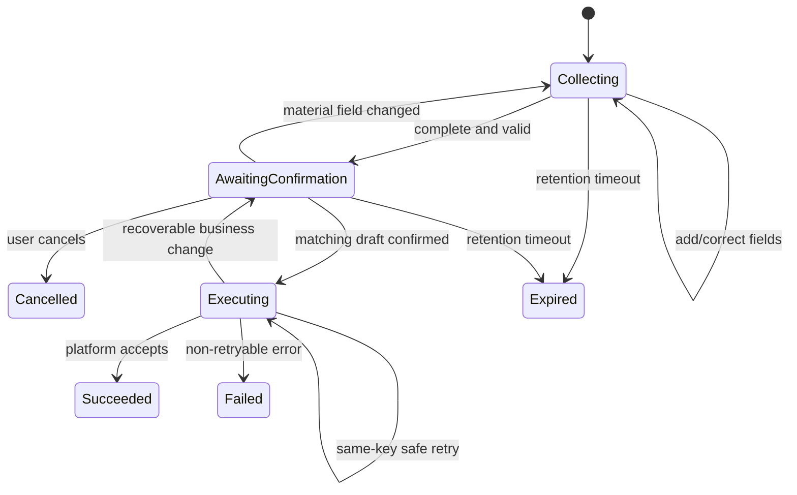

# Northstar Motors AI Webchat — Low-Level Design

## 1. Purpose

This document specifies the code structure, internal contracts, persistence schema, workflow state
machines, validation, integration behaviour, and test plan for the design in `HLD.md`.

## 2. Proposed repository structure

```text
northstar-motors-webchat/
├── compose.yaml
├── .env.example
├── dealership-platform/              # supplied; do not change behaviour/data
├── dealership-website/
│   └── index.html                     # one external widget script tag only
└── webchat-service/
    ├── Dockerfile
    ├── pyproject.toml
    ├── webchat/
    │   ├── main.py                    # application factory/lifespan
    │   ├── config.py                  # environment validation
    │   ├── api/
    │   │   ├── conversations.py       # public HTTP routes
    │   │   ├── models.py              # browser request/response schemas
    │   │   └── errors.py
    │   ├── domain/
    │   │   ├── models.py              # messages, turns, view models
    │   │   ├── workflows.py           # draft/confirm state machines
    │   │   ├── policy.py              # allowed tools and mutation gates
    │   │   └── business_semantics.py  # deterministic result/error mapping
    │   ├── orchestration/
    │   │   ├── orchestrator.py
    │   │   ├── prompt.py
    │   │   ├── tool_registry.py
    │   │   └── context.py
    │   ├── tools/
    │   │   ├── catalogue.py
    │   │   ├── sales.py
    │   │   ├── workshop.py
    │   │   └── contact.py
    │   ├── integrations/
    │   │   ├── dealership.py
    │   │   ├── dealership_models.py
    │   │   ├── llm.py
    │   │   └── openai_provider.py
    │   ├── persistence/
    │   │   ├── database.py
    │   │   ├── migrations/
    │   │   └── repositories.py
    │   ├── observability/
    │   │   ├── logging.py
    │   │   └── redaction.py
    │   └── widget/                    # service-hosted browser bundle
    │       ├── embed.js               # one-script entry point
    │       ├── northstar-chat-widget.js
    │       ├── webchat.js
    │       ├── webchat-api.js
    │       ├── webchat-view.js
    │       ├── webchat-context.js
    │       └── webchat.css
    └── tests/
        ├── unit/
        ├── integration/
        ├── contract/
        └── browser/
```

## 3. Browser application design

### 3.1 State model

```js
{
  lifecycle: "closed" | "open",
  connection: "idle" | "sending" | "reconnecting" | "unavailable" | "error",
  conversationId: string | null,
  messages: MessageView[],
  pendingTurnId: string | null,
  unreadCount: number,
  pageContext: {
    path: string,
    section: "home" | "vehicles" | "offers" | "locations" | "service" | "unknown",
    vehicleId: string | null,
    title: string
  }
}
```

Only `conversationId` and the open/closed preference are stored in local storage. Conversation
authorization uses an `HttpOnly`, `SameSite=Lax` cookie that browser JavaScript cannot read. Local
cross-origin requests are restricted to `WEBCHAT_ALLOWED_ORIGIN` with credentials; production may
use a same-origin edge route. The transcript restored from the backend is authoritative.

### 3.2 UI composition

- `WebchatLauncher`: accessible name, online/unavailable indicator, unread badge.
- `WebchatPanel`: labelled dialog region, heading, close/new-conversation controls.
- `Transcript`: ordered message list and polite status live region.
- `Message`: user/assistant/system status variant with timestamp.
- `VehicleCard` / `OfferCard`: closed schemas, safe text, allow-listed links.
- `ChoiceList`: buttons that submit a stable choice ID plus visible label.
- `PrivateBookingLookupCard`: four labelled identity fields submitted directly to the deterministic
  lookup endpoint; values are cleared after the request and never added to the transcript.
- `ConfirmationCard`: material operation fields, edit/cancel/confirm actions.
- `ReceiptCard`: status, public reference, selected details, and safe next steps.
- `Composer`: text area, send/retry states, character counter near limit.

All rendering uses `textContent` and explicit DOM attributes. Vehicle URLs are constructed from a
validated `veh-` identifier rather than accepted as model HTML.

### 3.3 Page context

`webchat-context.js` reads:

- `window.location.pathname`;
- known hash/section IDs;
- the `vehicle` query parameter only when it matches `^veh-[0-9]{3}$`;
- a constant/allow-listed page title.

An optional host may call the public `NorthstarChat.setContext` API. Without host integration, the
widget derives context from the safe URL fields above. It never copies arbitrary visible page text
into the model context.

### 3.4 Network behaviour

The turn endpoint is synchronous and returns one complete JSON response with HTTP 200. Immediately
after submission, the UI adds the user's message, disables duplicate submission, and announces a
generic “Northstar is working on that” progress state. It replaces that state when the response
arrives or shows a retryable error after the bounded request timeout.

On an ambiguous network failure, the browser restores the conversation before retrying. A retry
uses the same `clientMessageId`, so the backend returns the already-running or completed turn rather
than executing it again. Confirmed actions use the same rule with `clientActionId`.

## 4. Public webchat API

All endpoints are under `/api/chat/v1`. The local widget calls the published service using a
credentialed, explicitly allow-listed origin; production may use a same-origin edge route. JSON
bodies reject unknown security-sensitive fields. Conversation endpoints require the random
`northstar_chat` authorization cookie after creation. State-changing requests validate the exact
configured `Origin` header and accept JSON only.

### 4.1 Create conversation

`POST /api/chat/v1/conversations`

Request:

```json
{
  "pageContext": {
    "path": "/",
    "section": "vehicles",
    "vehicleId": "veh-001",
    "title": "Used Cars | Northstar Motors"
  }
}
```

Response `201`:

```json
{
  "conversationId": "uuid",
  "createdAt": "2026-08-21T10:00:00Z",
  "messages": []
}
```

The response sets `northstar_chat={random-token}; HttpOnly; SameSite=Lax; Path=/api/chat` and adds
`Secure` outside local HTTP development. Only a SHA-256/HMAC-derived token hash is stored by the
service.

### 4.2 Restore conversation

`GET /api/chat/v1/conversations/{conversationId}`

Returns metadata, ordered messages, safe typed view payloads, and a pending confirmation if one is
still valid. It never returns model tool arguments, idempotency keys, lookup proofs, or internal
record IDs.

### 4.3 Send message

`POST /api/chat/v1/conversations/{conversationId}/turns`

Request:

```json
{
  "clientMessageId": "uuid",
  "text": "Can I test drive this next Saturday?",
  "pageContext": {
    "path": "/",
    "section": "vehicles",
    "vehicleId": "veh-001",
    "title": "Used Cars | Northstar Motors"
  }
}
```

Constraints: UTF-8 text, trimmed length 1–4000, valid client UUID, allow-listed context, maximum one
active turn per conversation. Reusing `clientMessageId` returns the original turn.

Response `200` contains:

```json
{
  "turnId": "uuid",
  "status": "completed",
  "messages": []
}
```

If the same `clientMessageId` is still running, the endpoint waits for that existing turn within
the normal request timeout. If it already completed, the stored response is returned.

### 4.4 Confirm or cancel a draft

- `POST /api/chat/v1/conversations/{conversationId}/drafts/{draftId}/confirm`
- `POST /api/chat/v1/conversations/{conversationId}/drafts/{draftId}/cancel`

The confirm request contains `clientActionId` only. It cannot override draft fields. A field edit is
a new chat turn that updates the draft and requires a new confirmation.

### 4.5 Submit private workshop-booking lookup

`POST /api/chat/v1/conversations/{conversationId}/workshop-booking-lookup`

```json
{
  "reference": "WORK-10001",
  "lastName": "Taylor",
  "registration": "AB12 CDE",
  "phone": "07700900123"
}
```

This endpoint is submitted by a structured sensitive-input card. It deterministically validates
and forwards the four values to the platform lookup without adding them to a message, workflow
draft, model request, or log. A successful response stores a short-lived verified grant and returns
only the safe booking view. A mismatch returns the same generic `BOOKING_NOT_FOUND` presentation
regardless of which value differed. The ordinary composer does not collect these four values while
this card is active.

### 4.6 Delete/local reset

`DELETE /api/chat/v1/conversations/{conversationId}` marks the conversation for deletion and
invalidates its token, and clears the authorization cookie with `Max-Age=0`. It does not delete
dealership business records.

### 4.7 Health

- `GET /health/live`: process and event-loop health.
- `GET /health/ready`: migration/database readiness and configuration validity; dependency status
  is reported without leaking credentials.

## 5. Domain models

### 5.1 Message and view models

```python
class Message:
    id: UUID
    conversation_id: UUID
    turn_id: UUID | None
    role: Literal["user", "assistant", "status"]
    text: str
    view_type: Literal[
        "none", "vehicle_list", "vehicle_comparison", "offer_list",
        "slot_list", "choice_list", "confirmation", "receipt", "error"
    ]
    view_payload: dict | None
    created_at: datetime
```

View payloads use versioned discriminated schemas and contain only safe customer-facing fields.

### 5.2 Workflow draft

```python
class WorkflowDraft:
    id: UUID
    conversation_id: UUID
    kind: OperationKind
    state: Literal["collecting", "awaiting_confirmation", "executing", "succeeded", "failed", "cancelled", "expired"]
    fields: dict
    material_hash: str | None
    idempotency_key: str | None
    platform_record_id: str | None
    public_reference: str | None
    platform_status: str | None
    last_error_code: str | None
    version: int
    created_at: datetime
    updated_at: datetime
    expires_at: datetime
```

`fields` is validated against a schema selected by `kind`; it is not treated as arbitrary trusted
JSON. Secret lookup proof values use a separate short-retention record.

### 5.3 Operation kinds and required fields

| Kind | Required material fields |
| --- | --- |
| `sales_enquiry` | dealership ID, optional vehicle ID, enquiry type, message, contact |
| `test_drive` | returned slot ID, contact, optional notes |
| `vehicle_interest` | reserved vehicle ID, contact, optional notes |
| `callback` | dealership ID, department, optional vehicle ID/time, reason, contact |
| `workshop_booking` | returned slot ID, registration, mileage, contact, optional notes |
| `workshop_amend` | verified grant ID plus at least one of returned slot ID/mileage/notes |
| `workshop_cancel` | verified grant ID and current public booking summary |
| `dealership_message` | dealership ID, department, subject, message, contact method, contact |
| `part_exchange` | dealership ID, registration, mileage, condition, contact |

Contact follows the platform `Contact` schema: first name, last name, email, and phone. The
webchat mirrors platform validation and treats the platform response as final.

## 6. Persistence schema

SQLite uses foreign keys, WAL mode, busy timeout, UTC timestamps, and explicit migrations.

### `conversations`

| Column | Type/constraint |
| --- | --- |
| `id` | TEXT UUID primary key |
| `token_hash` | BLOB unique, not null |
| `status` | TEXT: active/deleted/expired |
| `summary` | TEXT nullable |
| `last_page_context_json` | TEXT validated JSON |
| `created_at`, `updated_at`, `expires_at` | UTC TEXT not null |

### `messages`

| Column | Type/constraint |
| --- | --- |
| `id` | TEXT UUID primary key |
| `conversation_id` | FK with delete cascade |
| `turn_id` | nullable FK |
| `sequence` | INTEGER; unique per conversation |
| `role` | checked TEXT |
| `text` | TEXT with application length limit |
| `view_type`, `view_payload_json`, `created_at` | typed metadata |

### `turns`

| Column | Type/constraint |
| --- | --- |
| `id` | TEXT UUID primary key |
| `conversation_id` | FK |
| `client_message_id` | TEXT; unique per conversation |
| `status` | running/completed/failed |
| `correlation_id` | TEXT unique |
| `error_category` | nullable sanitized code |
| `started_at`, `completed_at` | UTC TEXT |

### `workflow_drafts`

Contains the `WorkflowDraft` fields above. `(conversation_id, id, version)` and compare-and-swap
updates prevent double confirmation. A partial unique index permits at most one executing attempt
for a draft.

### `operation_attempts`

| Column | Type/constraint |
| --- | --- |
| `id` | TEXT UUID primary key |
| `draft_id` | FK |
| `conversation_id` | FK |
| `client_action_id` | TEXT not null; unique with `conversation_id` |
| `idempotency_key` | TEXT nullable; unique when present and required for record creation |
| `request_fingerprint` | TEXT not null |
| `state` | prepared/sent/succeeded/failed/unknown |
| `platform_record_id`, `public_reference`, `platform_status` | nullable result snapshot |
| `error_code`, `retryable`, timestamps | sanitized outcome metadata |

### `verified_booking_grants`

| Column | Type/constraint |
| --- | --- |
| `id` | TEXT UUID primary key |
| `conversation_id` | FK |
| `booking_record_id` | TEXT stored server-side only |
| `booking_reference` | TEXT |
| `booking_snapshot_json` | safe normalized fields |
| `expires_at`, `revoked_at` | short-lived authorization state |

The raw surname, registration, and phone used for lookup exist only in the validated request and
upstream call. They are not stored in messages, drafts, grants, model input, or logs. The sensitive
card sends all four fields in one request, so there is no resumable partial proof to persist. The
privacy notice explains that personal information voluntarily entered into the ordinary chat
composer remains subject to normal transcript retention.

## 7. Orchestration algorithm

For each accepted turn:

1. Authorize the conversation cookie and obtain a per-conversation lock.
2. Deduplicate `clientMessageId` and persist the user message/turn.
3. Normalize page context and resolve explicit selected entities.
4. Load the compact conversation summary, recent messages, active draft, and safe entity context.
5. Build the model request with policy, business rules, current date/timezone, and allowed tools.
6. Execute at most 6 tool-loop iterations and at most 8 tool calls, with no more than 3 catalogue
   searches in one turn.
7. For each proposal, validate the exact tool schema and apply policy:
   - read tools may execute;
   - draft tools may update validated workflow state;
   - mutations require the dedicated stored-draft confirmation path;
   - booking management requires a valid verified grant.
8. Normalize tool output and return only the fields needed for response composition.
9. Validate the final response envelope and typed view models.
10. Persist the assistant message, mark the turn complete, and release the lock.

The HTTP handler awaits this work but shields the persisted turn task from client-disconnect
cancellation. A duplicate request with the same `clientMessageId` awaits the same in-process task
or returns its stored result. On service restart, an orphaned `running` turn becomes `failed` and
can be safely retried with the same ID; confirmed record creation remains protected by its stored
operation attempt and idempotency key.

If the model returns invalid arguments twice for the same request, the orchestrator asks a safe
clarifying question or returns a controlled error instead of guessing.

## 8. Internal tool catalogue

### 8.1 Read tools

| Internal tool | Platform operation | Important policy |
| --- | --- | --- |
| `search_vehicles` | `GET /api/vehicles` | Allow-listed filters; pence integers; page size capped at 6 for chat |
| `get_vehicle` | `GET /api/vehicles/{id}` | Validate stable vehicle ID |
| `get_vehicle_availability` | `GET /api/vehicles/{id}/availability` | Required before dependent action |
| `list_offers` / `get_offer` | `GET /api/offers...` | Do not calculate missing terms |
| `list_dealerships` / `get_dealership` | dealership GETs | Public fields only |
| `get_opening_hours` | opening-hours GET | Preserve department and exceptions |
| `list_service_types` | `GET /api/service-types` | Return only platform-supported services |
| `list_test_drive_slots` | `GET /api/test-drive-slots` | Optional dealership/vehicle/date range |
| `list_workshop_locations` | `GET /api/workshop-locations` | Public read |
| `list_workshop_slots` | `GET /api/workshop-availability` | Dealership/service/date range |
| `get_business_information` | `GET /api/business-information` | Select relevant notice without paraphrasing away qualification |

### 8.2 Workflow tools

- `prepare_sales_enquiry`
- `prepare_test_drive`
- `prepare_vehicle_interest`
- `prepare_callback`
- `prepare_workshop_booking`
- `request_workshop_booking_lookup_form`
- `prepare_workshop_amendment`
- `prepare_workshop_cancellation`
- `prepare_dealership_message`
- `prepare_part_exchange`

Prepare tools validate and store drafts. They return `missingFields`, a safe summary, and either
`collecting` or `awaiting_confirmation`. They do not call a write endpoint.

`confirm_draft` is application-owned and invoked by the confirmation endpoint, not exposed as a
free-form model tool. The booking-lookup tool only renders the private form; the dedicated endpoint
performs the actual lookup without sending proof values through the LLM.

## 9. Workflow state machine



The material hash is a canonical JSON hash of operation kind plus normalized material fields.
Whitespace/case normalization is limited to fields whose business meaning permits it. The exact
canonical request fingerprint is stored beside the idempotency key.

## 10. Detailed business flows

### 10.1 Vehicle search and refinement

The orchestrator keeps a `vehicle_search_context` with supported filters and last result IDs. A
follow-up such as “make them electric” updates `fuelType`; “start over” clears constraints. The
model cannot filter a result by facts that are absent from platform data without explaining that
limitation.

Result cards resolve image paths against the configured platform public base URL and website links
against the configured website base URL. URL construction validates both the scheme/host config
and record ID.

### 10.2 Test drive

1. Resolve vehicle and call current availability.
2. If available, query slots; if reserved/sold, apply documented alternative actions.
3. Store the chosen returned slot ID and collect contact/notes.
4. Recheck material summary and request confirmation.
5. Persist UUID idempotency key, then `POST /api/test-drive-bookings` with `X-API-Key`.
6. On `201`, show status `confirmed`, reference, vehicle, location, and appointment.
7. On `SLOT_UNAVAILABLE`, mark the old slot invalid and offer a new search.
8. On timeout, retry identical body/key or restore the attempt before allowing a new action.

### 10.3 Reserved interest and sold vehicles

Immediately before interest registration, availability must be `reserved`. An available vehicle
does not accept interest; offer enquiry/test drive instead. A sold vehicle may still create a
sales enquiry but not a test drive or interest record.

### 10.4 Workshop booking

1. Resolve a platform service type and workshop location.
2. Query current returned slots for an explicit date range.
3. Collect slot, registration, non-negative integer mileage, contact, and notes.
4. Confirm the normalized registration, mileage, service, dealership, and appointment.
5. Persist idempotency key and create the booking.
6. Report only the platform's `confirmed` outcome and returned reference.

Zero Bolton slots during the first seven seeded days is an empty success, not an outage.

### 10.5 Lookup, amend, and cancel

1. Render the private lookup card and submit reference, surname, registration, and phone to the
   dedicated deterministic webchat endpoint.
2. Validate in memory and call `POST /api/workshop-bookings/lookup` server-side without persisting
   or sending the proof values to the model.
3. For any mismatch, return the same generic not-found response and apply attempt rate limits.
4. On success, create a short-lived verified grant and show the safe booking snapshot.
5. Amendment requires the grant and a changed allowed field. A new slot must come from a current
   availability response. Confirm before `PATCH`.
6. Cancellation shows current booking details and requires confirmation before `DELETE`.
7. `SLOT_UNAVAILABLE` during amendment leaves the stored snapshot/original booking unchanged.
8. Revoke/update the grant after cancellation or expiry.

### 10.6 Part exchange

Validate condition as `excellent`, `good`, or `fair`, and mileage as non-negative. After confirmed
creation, format `estimateLowPence` and `estimateHighPence` using `en-GB` GBP currency semantics and
include the returned qualification/notices. Do not label the value a guaranteed offer.

## 11. Dealership adapter contract

```python
class DealershipClient(Protocol):
    async def list_dealerships(self) -> list[Dealership]: ...
    async def get_dealership(self, dealership_id: str) -> Dealership: ...
    async def get_opening_hours(self, dealership_id: str) -> OpeningHours: ...
    async def search_vehicles(self, query: VehicleSearch) -> Page[Vehicle]: ...
    async def get_vehicle(self, vehicle_id: str) -> Vehicle: ...
    async def get_vehicle_availability(self, vehicle_id: str) -> Availability: ...
    async def list_offers(self, query: OfferSearch) -> list[Offer]: ...
    async def get_offer(self, offer_id: str) -> Offer: ...
    async def list_service_types(self) -> list[ServiceType]: ...
    async def list_test_drive_slots(self, query: SlotSearch) -> list[TestDriveSlot]: ...
    async def create_sales_enquiry(self, body: SalesEnquiryCreate, key: str) -> OperationReceipt: ...
    async def create_test_drive(self, body: TestDriveCreate, key: str) -> OperationReceipt: ...
    async def create_vehicle_interest(self, body: InterestCreate, key: str) -> OperationReceipt: ...
    async def create_callback(self, body: CallbackCreate, key: str) -> OperationReceipt: ...
    async def list_workshop_locations(self) -> list[WorkshopLocation]: ...
    async def list_workshop_slots(self, query: WorkshopSlotSearch) -> list[WorkshopSlot]: ...
    async def create_workshop_booking(self, body: WorkshopCreate, key: str) -> BookingReceipt: ...
    async def lookup_workshop_booking(self, proof: BookingLookup) -> WorkshopBooking: ...
    async def update_workshop_booking(self, record_id: str, body: WorkshopPatch) -> WorkshopBooking: ...
    async def cancel_workshop_booking(self, record_id: str) -> WorkshopBooking: ...
    async def create_dealership_message(self, body: MessageCreate, key: str) -> OperationReceipt: ...
    async def create_part_exchange(self, body: PartExchangeCreate, key: str) -> ValuationReceipt: ...
    async def get_business_information(self) -> BusinessInformation: ...
```

Protected methods attach the API key internally; callers cannot supply headers. Every
record-creation method receives a backend-generated key. Amendment and cancellation methods do not
accept a key because those platform operations do not expose an idempotency-key parameter.

### Error normalization

```python
class PlatformError(Exception):
    http_status: int
    code: str
    safe_message: str
    field_errors: dict[str, str]
    retryable: bool
    correlation_id: str
```

Unknown/non-JSON upstream errors become `UPSTREAM_ERROR` with no response body exposed. Known codes
retain deterministic handling: `VALIDATION_ERROR`, `NOT_FOUND`, `BOOKING_NOT_FOUND`,
`SLOT_UNAVAILABLE`, `VEHICLE_RESERVED`, `VEHICLE_UNAVAILABLE`, `IDEMPOTENCY_CONFLICT`,
`UNAUTHORISED`, and `INTERNAL_ERROR`.

Retry policy:

- GET: up to 2 retries for connection failure, timeout, 429, or retryable 5xx.
- Record-creation POST: retry only with the identical body and persisted idempotency key.
- Workshop lookup POST: one retry only when the request is known not to have reached the platform;
  otherwise allow the customer to resubmit the same proof because the operation is read-only.
- PATCH/DELETE: do not blind-retry an ambiguous outcome. Use the verified internal booking ID to
  read and reconcile the current booking state, then report the known result or an unknown outcome.
- Never retry validation, conflict business rules, authorization, or not-found errors blindly.

## 12. Prompt and response contract

The system policy contains:

- role and Northstar scope;
- current server date and timezone;
- tool-use requirement for dynamic facts;
- prohibition on invented price, availability, offer, hours, policy, or outcome;
- distinction between received/requested/registered/estimated/confirmed/cancelled;
- confirmation and privacy rules;
- prompt-injection and secret-exposure rules;
- concise, helpful UK English response style.

The provider must return either a tool proposal or a response envelope:

```json
{
  "text": "I found three matching vehicles.",
  "view": {
    "type": "vehicle_list",
    "version": 1,
    "items": []
  },
  "suggestions": [
    {"id": "compare", "label": "Compare these"}
  ]
}
```

Application code validates the envelope, reconstructs sensitive/status-dependent view models from
trusted tool output where necessary, and strips unknown fields.

## 13. Validation rules

- IDs: exact stable formats/allow-listed returned values; never arbitrary URLs.
- Email: syntactically valid, normalized conservatively, maximum 254 characters.
- UK phone: defer final validity to platform while enforcing reasonable length/character bounds.
- Names: trimmed, platform-compatible length, no blank values.
- Registration: trimmed and normalized for display/comparison without inventing validity.
- Mileage and money: base-10 non-negative integers; prices sent in pence.
- Dates: ISO `YYYY-MM-DD` at adapters; relative text is resolved then explicitly confirmed.
- Free text: platform maximums where defined; webchat maximum at or below them; control characters
  removed except normal whitespace.
- Enumerations: exact platform values for enquiry type, department, preferred contact method,
  condition, offer product type, availability, and inventory sort.

## 14. Concurrency and idempotency

- An in-process lock serializes turns per conversation for the single-container assignment.
- Database uniqueness deduplicates client message/action IDs even if requests race.
- Draft confirmation uses a transaction and version compare-and-swap from
  `awaiting_confirmation` to `executing`.
- For record creation, the idempotency key and request fingerprint commit before the upstream call.
- Amendment and cancellation attempts persist `clientActionId` and request fingerprint before the
  call, then reconcile through the booking read endpoint after an ambiguous outcome.
- A second confirmation reads the existing attempt and returns its current/final state.
- Platform `IDEMPOTENCY_CONFLICT` is treated as an internal safety fault, not worked around with a
  fresh key.

For multi-instance production, replace the in-process lock with database/distributed locking while
retaining the same uniqueness and state transition rules.

## 15. Logging and redaction

Allowed structured fields:

```text
timestamp, level, service, event, correlation_id, conversation_hash,
turn_id, tool_name, operation_kind, upstream_path_template,
http_status, platform_error_code, retryable, duration_ms, retry_count
```

Redacted/omitted fields include API keys, authorization headers, email, phone, names, registration,
booking proof, notes/messages, exact prompts, and raw upstream bodies. Exceptions are converted to
sanitized categories before logging.

## 16. Test design

### 16.1 Unit tests

- search context refinement and reset;
- exact money formatting and `null` price handling;
- required-field detection for every operation kind;
- draft material hashing, edit invalidation, expiry, and double confirmation;
- platform status-to-claim mapping;
- all documented error recovery mappings;
- verified grant required/expired/revoked paths;
- page-context allow-list and safe link construction;
- cookie-token verification, same-origin request checks, and log redaction;
- private booking-proof submission never entering messages, model input, drafts, or logs;
- tool loop/count limits and invalid model payload handling.

### 16.2 Contract tests

Use recorded representative payloads derived from `dealership-platform/openapi.json` and assert:

- query names and pence integer encoding;
- protected headers are attached only server-side;
- mandatory booking and optional record-creation idempotency headers;
- absence of an invented idempotency header contract for PATCH/DELETE;
- every write request body matches the platform contract;
- structured success and error responses normalize correctly;
- relative image paths resolve against the configured platform URL.

### 16.3 Seeded integration tests

- `veh-001`: successful availability and test-drive path.
- `veh-007`: reserved error and successful interest path.
- `veh-013`: sold test-drive prevention and allowed sales enquiry.
- `veh-019`: price-on-request response.
- published offer terms and finance notice without invented values.
- successful sales enquiry (`received`), interest (`registered`), and callback (`requested`).
- successful dealership message (`received`) and part-exchange estimate (`estimated`) with its
  qualification.
- Bolton: no first-week workshop results without false outage.
- `WORK-10001`/Taylor/`AB12 CDE`/`07700900123`: successful verified lookup.
- one-field lookup mismatch: generic `BOOKING_NOT_FOUND`.
- workshop booking/amend/cancel and released-slot behaviour.
- same key/body replay and different-body conflict safety.
- holiday exception and part-exchange qualification.

Each mutation test resets seeded platform state or uses isolated generated inputs to remain
repeatable.

### 16.4 Browser tests

- launcher positioning at desktop/mobile sizes;
- open/close focus loop, Escape, tab order, and live announcements;
- send/loading/retry and duplicate-click prevention;
- transcript restore after reload;
- authorization cookie is `HttpOnly` and the token is absent from local storage and JavaScript;
- private booking-lookup fields are cleared and absent from transcript/model-facing requests;
- selected vehicle context from the website dialog;
- vehicle/offer/slot/confirmation/receipt rendering;
- unread badge when a response finishes while closed;
- LLM and platform unavailable states;
- no secret in DOM, JS bundles, storage, or browser network headers.

## 17. Definition of done

- All P0 requirements and PRD acceptance scenarios pass or have a documented limitation approved
  before handoff.
- Docker Compose starts the platform, website, and webchat from a clean checkout.
- `.env.example`, setup instructions, migration behaviour, important decisions, and limitations are
  documented.
- No supplied dealership behaviour or seeded data is changed.
- The API key is absent from browser-delivered assets and protected operations work through the
  server.
- Tests cover read flows, every write family, idempotency, verified booking management, error
  recovery, persistence, and accessibility-critical interactions.
- Logs demonstrate correlation and redaction without containing customer contact or secrets.
