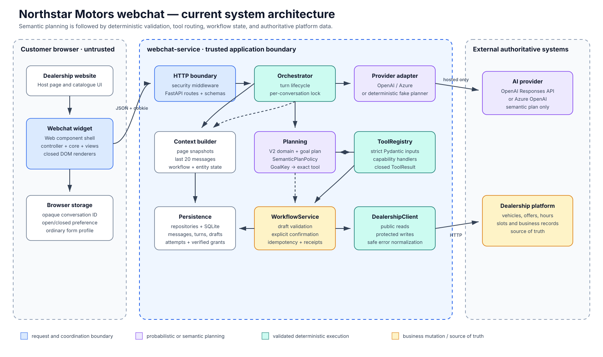

# Northstar webchat service

`webchat-service` is the server-side policy, persistence, AI orchestration, workflow, and widget
boundary for Northstar Motors. It serves the browser widget and `/api/chat/v1`, calls the supplied
dealership API, and stores webchat-owned state in SQLite.

## Architecture at a glance



The AI produces a versioned domain-and-goal plan. Application code resolves context, chooses exact tools, validates
arguments, performs dealership reads, prepares write drafts, and requires explicit confirmation
before protected mutations.

## Run locally

From the repository root:

```bash
cp .env.example .env
docker compose up --build -d
```

Open `http://localhost:4173`. With no hosted-provider credentials, non-production environments use
the deterministic fake LLM provider.

## Verify

```bash
docker build --target test -t northstar-webchat-test:refactor ./webchat-service
docker run --rm northstar-webchat-test:refactor
docker run --rm northstar-webchat-test:refactor ruff check webchat tests
```

The current Python suite contains 335 tests. Also run JavaScript syntax checks after widget changes:

```bash
for file in $(find webchat-service/webchat/widget -name '*.js'); do
  node --check "$file" || exit 1
done
node --test webchat-service/tests/browser/*.mjs
```

## Top-level files and folders

| Path | Purpose |
| --- | --- |
| [`Dockerfile`](./Dockerfile) | Base, test, and runtime image stages; the test image runs Pytest by default |
| [`pyproject.toml`](./pyproject.toml) | Package metadata, runtime/dev dependencies, nested widget assets, Pytest/Ruff settings |
| [`webchat/`](./webchat/README.md) | Runtime Python package plus service-hosted widget |
| [`tests/`](./tests/README.md) | Unit, integration, contract, security, and health verification |

## Runtime boundaries

- Browser code never receives the dealership or AI API keys.
- Dynamic business facts come from `DealershipClient` calls.
- Specific business-information questions render only relevant platform facts; unsupported facts
  fail closed with a dealership-contact offer instead of a generic notice card.
- The model cannot confirm a write or choose an arbitrary HTTP endpoint.
- Card-capable business requests cannot silently fall through to provider prose when
  `SemanticPlanPolicy` is in enforcement mode.
- Workflow contact details are stored server-side in a validated draft and hidden from confirmation
  summaries.
- Workshop lookup proof bypasses model/transcript storage and is excluded from saved browser forms.
- `dealership-platform` is an external authoritative dependency and must not be edited as part of
  webchat maintenance.

## Detailed design

- [High-level design](../docs/HLD.md)
- [Low-level design](../docs/LLD.md)
- [Architecture diagrams](../docs/diagrams/README.md)
- [Integration guide](../docs/INTEGRATION-GUIDE.md)
- [Widget integration](../docs/WIDGET-INTEGRATION.md)

## Where changes belong

| Change | Owner |
| --- | --- |
| HTTP route or browser request schema | `webchat/api` |
| Workflow fields, confirmation, or receipts | `webchat/domain` and `webchat/persistence` |
| AI provider HTTP format | `webchat/integrations/openai_provider.py` |
| Provider-independent deterministic routing | `webchat/orchestration/routing` |
| Fake-provider semantic planning | `webchat/integrations/fake_llm` |
| Domain-goal ontology and exact tool mapping | `webchat/orchestration/planning` |
| Dealership read presentation | `webchat/orchestration/tools` |
| Final response/suggestions | `webchat/orchestration/presentation` |
| Widget transport/context utilities | `webchat/widget/core` |
| Widget cards/forms | `webchat/widget/views` |

Keep module dependencies pointed inward through contracts; wire concrete implementations only in
`webchat/main.py`.
